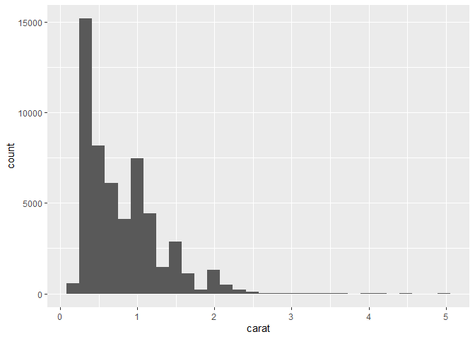
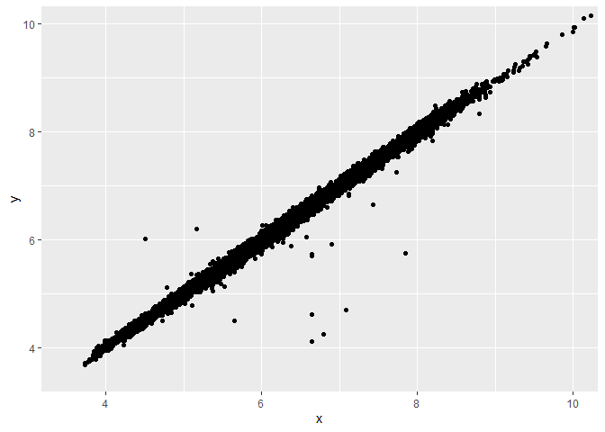
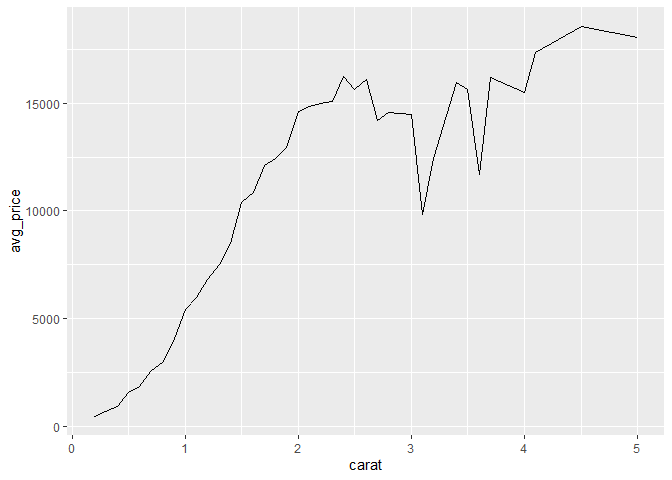
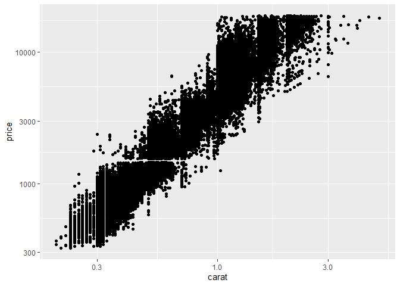
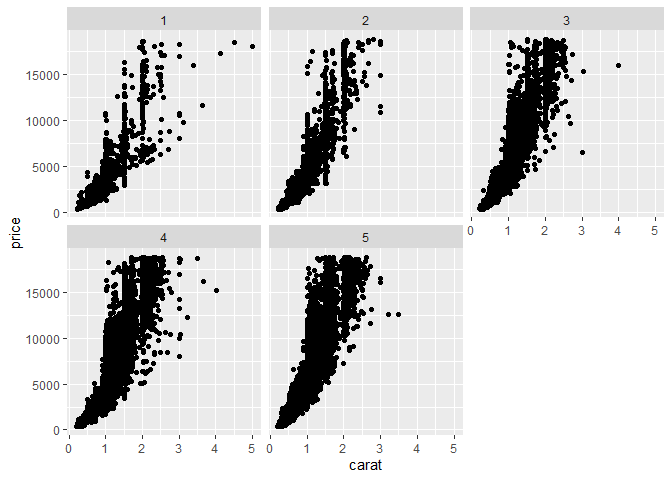
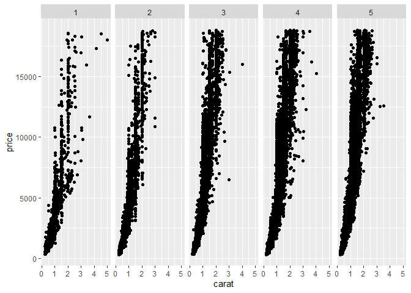

Lecture 2: Data Visualization
================
MAYOL, JOSE RAPHAEL J.
2025-02-02

# 1 Case Study: Diamonds

In this lecture, we will explore the diamonds dataset built into
ggplot2.

``` r
library(tidyverse)
```

    ## ── Attaching core tidyverse packages ──────────────────────── tidyverse 2.0.0 ──
    ## ✔ dplyr     1.1.4     ✔ readr     2.1.5
    ## ✔ forcats   1.0.0     ✔ stringr   1.5.1
    ## ✔ ggplot2   3.5.1     ✔ tibble    3.2.1
    ## ✔ lubridate 1.9.4     ✔ tidyr     1.3.1
    ## ✔ purrr     1.0.2     
    ## ── Conflicts ────────────────────────────────────────── tidyverse_conflicts() ──
    ## ✖ dplyr::filter() masks stats::filter()
    ## ✖ dplyr::lag()    masks stats::lag()
    ## ℹ Use the conflicted package (<http://conflicted.r-lib.org/>) to force all conflicts to become errors

``` r
diamonds
```

    ## # A tibble: 53,940 × 10
    ##    carat cut       color clarity depth table price     x     y     z
    ##    <dbl> <ord>     <ord> <ord>   <dbl> <dbl> <int> <dbl> <dbl> <dbl>
    ##  1  0.23 Ideal     E     SI2      61.5    55   326  3.95  3.98  2.43
    ##  2  0.21 Premium   E     SI1      59.8    61   326  3.89  3.84  2.31
    ##  3  0.23 Good      E     VS1      56.9    65   327  4.05  4.07  2.31
    ##  4  0.29 Premium   I     VS2      62.4    58   334  4.2   4.23  2.63
    ##  5  0.31 Good      J     SI2      63.3    58   335  4.34  4.35  2.75
    ##  6  0.24 Very Good J     VVS2     62.8    57   336  3.94  3.96  2.48
    ##  7  0.24 Very Good I     VVS1     62.3    57   336  3.95  3.98  2.47
    ##  8  0.26 Very Good H     SI1      61.9    55   337  4.07  4.11  2.53
    ##  9  0.22 Fair      E     VS2      65.1    61   337  3.87  3.78  2.49
    ## 10  0.23 Very Good H     VS1      59.4    61   338  4     4.05  2.39
    ## # ℹ 53,930 more rows

Let’s recall some terminology from Lecture 1:

- **Variables:** What do variables in this dataset represent? How many
  of them are there?

- **Observations:** What do observations in this dataset represent? How
  many of them are there?

- **Values:** What are examples of values in this dataset?

- **Continuous:** Which variables are continuous?

- **Categorical:** Which variables are categorical?

We can learn more about the variables in this dataset by looking at the
documentation:

`{?diamonds}`

# 2 Exploratory Data Analysis

Before we start modeling our data, it’s a good idea to first explore it.
The goals of **exploratory data analysis** (EDA) are:

- Gaining a basic familiarity with the data

- Exploring the **variation** of individual variables (the tendency of
  the values of a variable to change from observation to observation)

- Exploring the **covariation** between pairs of variables (the tendency
  for the values of two or more variables to vary together in a related
  way)

- Identifying and, if possible, fixing flaws in the data

- Searching for patterns and generating hypotheses

We can explore data by visualizing it or transforming it.

# 3 Variation

## 3.1 Discrete variables

We usually use **bar charts** to visualize variation in discrete
variables. These can be created through geom_bar(), which requires the
aesthetic x (the variable whose variation we’d like to plot). Let’s take
a look at the variation in cut:

``` r
library(ggplot2)
ggplot(data = diamonds) +
  geom_bar(mapping = aes(x = cut))
```

<!-- -->

We can see that ‘Ideal’ is the most common kind of diamond cut.

## 3.2 Continuous variables

We usually use **histograms** to visualize variation in continuous
variables. These can be created through geom_histogram(), which requires
the aesthetic x (the variable whose variation we’d like to plot). Let’s
take a look at the variation in carat:

``` r
ggplot(data = diamonds) +
  geom_histogram(mapping = aes(x = carat))
```

    ## `stat_bin()` using `bins = 30`. Pick better value with `binwidth`.

<!-- -->

Most of the values of carat are below 3, so let’s zoom in to that
portion of the plot using coord_cartesian:

``` r
ggplot(data = diamonds) +
  geom_histogram(mapping = aes(x = carat)) +
  coord_cartesian(xlim = c(0,3))
```

    ## `stat_bin()` using `bins = 30`. Pick better value with `binwidth`.

<!-- -->

Note the warning message about the number of bins. We might need to
experiment to find a meaningful value for the number of bins in a
histogram. Let’s try decreasing the bin width:

``` r
ggplot(data = diamonds) +
  geom_histogram(mapping = aes(x = carat), binwidth = 0.01) +
  coord_cartesian(xlim = c(0,3))
```

<!-- -->

This particularly weird pattern exists because higher carat diamonds
tend to be much more expensive than their lower counterparts. That being
said, 1-carat diamonds managed to snag the second place since they
strike just the perfect balance of value and luxury for most buyers.

# 4 Covariation

## 4.1 Discrete versus discrete

We usually use **count plots** to visualize covariation between two
discrete variables. These represent the number of observations for which
the two variables take each combination of values via the size of
points. Count plots can be generated using geom_count(), and require x
and y aesthetics. For example, let’s assess the covariation between cut
and clarity:

``` r
ggplot(data = diamonds) +
  geom_count(mapping = aes(x = cut, y = clarity))
```

<!-- -->

It can be observed that higher cut quality tends to be associated with
higher clarity.

## 4.2 Continuous versus continuous

### 4.2.1 Many to one

We usually use **scatter plots** to visualize covariation between two
continuous variables. These are useful when we can have many y values
for each x value. Scatter plots can be generated using geom_point(), and
require x and y aesthetics. For example, let’s assess the covariation
between x and y:

``` r
ggplot(data = diamonds) +
  geom_point(mapping = aes(x = x, y = y))
```

<!-- -->

There seem to be some weird outliers in the data. We should probably
look into those more and perhaps remove them. For now, let’s just zoom
in on the part of the plot where most of the points lie:

``` r
ggplot(data = diamonds) +
  geom_point(mapping = aes(x = x, y = y)) +
  coord_cartesian(xlim = c(3.5, 10), ylim = c(3.5,10))
```

<!-- -->

It looks like most of the points lie near the line y = x. To confirm
this, we can add that line to the plot via geom_abline():

``` r
ggplot(data = diamonds) +
  geom_point(mapping = aes(x = x, y = y)) +
  geom_abline(slope = 1, intercept = 0, color = "purple") +
  coord_cartesian(xlim = c(3.5, 10), ylim = c(3.5,10))
```

<!-- -->

As predicted, the x and y values do indeed have equal values for the
most part. Note that horizontal and vertical lines may be added to plots
using geom_hline() and geom_vline(), respectively.

### 4.2.2 One to one

In some cases, we have only one value of y for each value of x. For
example, consider the average diamond price for each value of carat.
Let’s first construct the requisite data frame (you need not understand
the following code at this point):

``` r
avg_price_by_carat <- diamonds %>%
  mutate(carat = round(carat, 1)) %>%
  group_by(carat) %>%
  summarise(avg_price = mean(price))
avg_price_by_carat
```

    ## # A tibble: 38 × 2
    ##    carat avg_price
    ##    <dbl>     <dbl>
    ##  1   0.2      506.
    ##  2   0.3      709.
    ##  3   0.4      936.
    ##  4   0.5     1590.
    ##  5   0.6     1861.
    ##  6   0.7     2619.
    ##  7   0.8     2998.
    ##  8   0.9     3942.
    ##  9   1       5437.
    ## 10   1.1     6011.
    ## # ℹ 28 more rows

To plot avg_price versus carat, we would use a **line plot**. We can
create a line plot via geom_line(), which requires both x and y
aesthetics:

``` r
ggplot(data = avg_price_by_carat) +
  geom_line(mapping = aes(x = carat, y = avg_price))
```

<!-- -->

The relationship between average price and carat seems to be direct in
general. A higher carat diamond is priced more and vice versa. However,
there are wild fluctuations around the 3.X values. This may be
attributed to simply a small sample size, but in reality, this may
suggest that carat value may not be the only factor in pricing diamonds.

## 4.3 Continuous versus discrete

We usually use **box plots** to visualize covariation between a
continuous variable and a discrete variable. A single box plot is a way
to visualize the variation in a continuous variable, while side by side
box plots allow us to visualize how the distribution of a continuous
variable changes based on the values of a discrete variable. We can
construct side by side box plots via geom_boxplot(), which requires x
and y aesthetics. For example, let’s see how the price of a diamond
depends on its cut:

``` r
ggplot(data = diamonds) +
  geom_boxplot(mapping = aes(x = cut, y = price))
```

<!-- -->

The thick black lines in the middle denote the median price for each
cut. Median prices seem to increase as the cut quality improves, but
there is a sudden change of trend in the ‘Ideal’ category.

## 4.4 Correlation matrices

To get a more global view of the covariation in a dataset, we might want
to visualize its **correlation matrix**. A correlation is a number
between -1 and 1 that captures the strength of association between two
variables: 1 means perfectly correlated, 0 means uncorrelated, and -1
means perfectly anticorrelated. A correlation matrix visualizes the
correlations between all pairs of variables in a dataset. But since cut,
color, and clarity have ordered categorical values, then we must first
convert them into their numerical equivalents.

``` r
diamonds$cut <- as.numeric(factor(diamonds$cut, 
                                  levels = c("Fair", "Good", "Very Good", "Premium", "Ideal"), 
                                  ordered = TRUE))

diamonds$color <- as.numeric(factor(diamonds$color, 
                                    levels = c("J", "I", "H", "G", "F", "E", "D"), 
                                    ordered = TRUE))

diamonds$clarity <- as.numeric(factor(diamonds$clarity, 
                                      levels = c("I1", "SI2", "SI1", "VS2", "VS1", "VVS2", "VVS1", "IF"), 
                                      ordered = TRUE))
numeric_diamonds <- diamonds[, sapply(diamonds, is.numeric)]
corrmat <- cor(numeric_diamonds, use = "complete.obs")
corrmat
```

    ##               carat         cut       color     clarity       depth      table
    ## carat    1.00000000 -0.13496702 -0.29143675 -0.35284057  0.02822431  0.1816175
    ## cut     -0.13496702  1.00000000  0.02051852  0.18917474 -0.21805501 -0.4334046
    ## color   -0.29143675  0.02051852  1.00000000 -0.02563128 -0.04727923 -0.0264652
    ## clarity -0.35284057  0.18917474 -0.02563128  1.00000000 -0.06738444 -0.1603268
    ## depth    0.02822431 -0.21805501 -0.04727923 -0.06738444  1.00000000 -0.2957785
    ## table    0.18161755 -0.43340461 -0.02646520 -0.16032684 -0.29577852  1.0000000
    ## price    0.92159130 -0.05349066 -0.17251093 -0.14680007 -0.01064740  0.1271339
    ## x        0.97509423 -0.12556524 -0.27028669 -0.37199853 -0.02528925  0.1953443
    ## y        0.95172220 -0.12146187 -0.26358440 -0.35841962 -0.02934067  0.1837601
    ## z        0.95338738 -0.14932254 -0.26822688 -0.36695200  0.09492388  0.1509287
    ##               price           x           y           z
    ## carat    0.92159130  0.97509423  0.95172220  0.95338738
    ## cut     -0.05349066 -0.12556524 -0.12146187 -0.14932254
    ## color   -0.17251093 -0.27028669 -0.26358440 -0.26822688
    ## clarity -0.14680007 -0.37199853 -0.35841962 -0.36695200
    ## depth   -0.01064740 -0.02528925 -0.02934067  0.09492388
    ## table    0.12713390  0.19534428  0.18376015  0.15092869
    ## price    1.00000000  0.88443516  0.86542090  0.86124944
    ## x        0.88443516  1.00000000  0.97470148  0.97077180
    ## y        0.86542090  0.97470148  1.00000000  0.95200572
    ## z        0.86124944  0.97077180  0.95200572  1.00000000

We can plot this correlation matrix using the ggcorrplot() function from
the ggcorrplot package:

``` r
library(ggcorrplot)
ggcorrplot(corrmat, lab = TRUE, hc.order = TRUE)
```

<!-- -->

The ggcorrplot() function is highly customizable. The plot above was
created using lab = TRUE to add the correlation labels and hc.order =
TRUE to reorder the variables so that correlated ones appear next to
each other.

# 5 Additional visualization tools

## 5.1 Axis transformations

Some variable are better visualized on a transformed scale, e.g. on a
logarithmic scale. A tell-tale sign of a variable that would benefit
from a logarithmic transformation is a very long tail, as we saw with
carat:

``` r
ggplot(data = diamonds) +
  geom_histogram(aes(x = carat), binwidth = 0.01)
```

<!-- -->

We can put the x-axis on a logarithmic scale using scale_x_log10():

``` r
ggplot(data = diamonds) +
  geom_histogram(aes(x = carat), binwidth = 0.01) +
  scale_x_log10()
```

<!-- -->

The same goes for variables plotted on the y axis. For example:

``` r
ggplot(data = diamonds) +
  geom_point(aes(x = carat, y = price)) +
  scale_x_log10() +
  scale_y_log10()
```

<!-- -->

## 5.2 Multiple geoms in the same plot

We can add as many geoms as we want to the same plot. We’ve already seen
geom_point() and geom_abline() in the same plot. Let’s see another
example by adding the individual points to the plot of avg_price versus
carat:

``` r
ggplot(data = avg_price_by_carat) +
  geom_line(mapping = aes(x = carat, y = avg_price)) +
  geom_point(mapping = aes(x = carat, y = avg_price))
```

<!-- -->

Note that geom_line() and geom_point() have the same exact aesthetic
mapping. Any aesthetic mapping that applies to all geoms in a plot can
be placed inside of ggplot instead of inside the individual geoms. This
makes that aesthetic mapping “global”:

``` r
ggplot(data = avg_price_by_carat, mapping = aes(x = carat, y = avg_price)) +
  geom_line() +
  geom_point()
```

<!-- -->

## 5.3 Multiple aesthetics in the same geom

Any geom can have multiple aesthetics. We’ve already seen this,
e.g. specifying both x and y aesthetics for geom_point(). But we can add
still more aesthetics, e.g. color, for a richer plot. For example, let’s
consider plotting price versus carat:

``` r
ggplot(data = diamonds) +
  geom_point(mapping = aes(x = carat, y = price))
```

<!-- -->

We can color points based on the cut of the diamond:

``` r
ggplot(data = diamonds) +
  geom_point(mapping = aes(x = carat, y = price, color = cut))
```

<!-- -->

## 5.4 Faceting

Each plot so far has contained just one **panel**. Sometimes, we want to
break a plot into multiple panels based on the values of one or two
categorical variables in the data. For example, consider again the
relationship between price and carat. Instead of coloring points based
on cut, we can **facet** the plot based on cut. When using one faceting
variable, we would usually use facet_wrap():

``` r
ggplot(data = diamonds) +
  geom_point(mapping = aes(x = carat, y = price)) +
  facet_wrap(~cut)
```

<!-- -->

If we want all the panels to be in one row, we can also use
facet_grid():

``` r
ggplot(data = diamonds) +
  geom_point(mapping = aes(x = carat, y = price)) +
  facet_grid(. ~ cut)
```

<!-- -->

Usually though, facet_grid() is used to facet on two categorical
variables, creating a whole matrix of panels. For example:

``` r
ggplot(data = diamonds) +
  geom_point(mapping = aes(x = carat, y = price)) +
  facet_grid(clarity ~ cut)
```

<!-- -->

## 5.5 Plot customization

Virtually every aspect of a plot can be customized (plot title, axis
titles, legend placement, font sizes, aspect ratio, etc). Work through
the Customize Plots tutorial and/or R4DS Chapter 28 to learn more. The
most important reason to customize your plots is to make them easier to
read and interpret. In addition to correctness, your homework and exams
will be graded on **presentation quality**, including the quality of
your plots. See Section 4 of preparing-reports.pdf on Canvas for
concrete guidelines.
