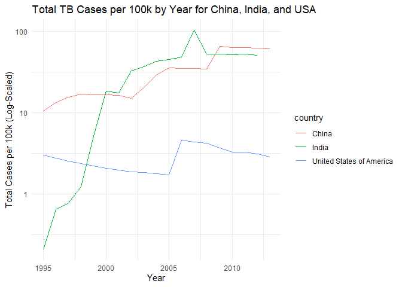
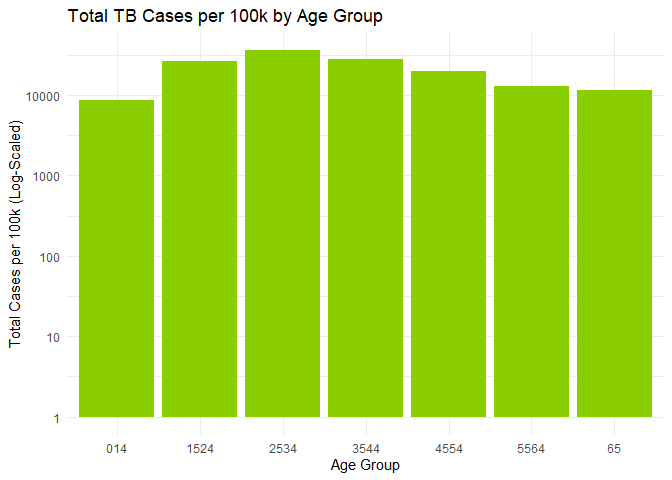
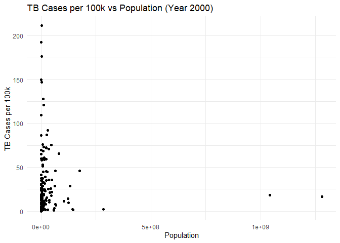

FA2
================
MAYOL, JOSE RAPHAEL J.
2025-02-15

# I. Introduction

In this formative assessment, you will review Unit 1, focusing on data
wrangling, manipulation, and visualization.

### Required Library

``` r
library(tidyverse)
```

    ## ── Attaching core tidyverse packages ──────────────────────── tidyverse 2.0.0 ──
    ## ✔ dplyr     1.1.4     ✔ readr     2.1.5
    ## ✔ forcats   1.0.0     ✔ stringr   1.5.1
    ## ✔ ggplot2   3.5.1     ✔ tibble    3.2.1
    ## ✔ lubridate 1.9.4     ✔ tidyr     1.3.1
    ## ✔ purrr     1.0.2     
    ## ── Conflicts ────────────────────────────────────────── tidyverse_conflicts() ──
    ## ✖ dplyr::filter() masks stats::filter()
    ## ✖ dplyr::lag()    masks stats::lag()
    ## ℹ Use the conflicted package (<http://conflicted.r-lib.org/>) to force all conflicts to become errors

You will perform a data analysis to study trends in tuberculosis (TB)
cases worldwide over time. The two relevant datasets are:

- **`who.tsv`**: Information about TB cases in various countries from
  1980 to 2013 (Source: 2014 WHO Global Tuberculosis Report).

- **`population.csv`**: Population data of each country across time
  (Source: The World Bank).

# 2. Import

#### 2.1. Preview the contents of **`who.tsv`** and **`population.csv`** by inspecting the files.

``` r
who
```

    ## # A tibble: 7,240 × 60
    ##    country  iso2  iso3   year new_sp_m014 new_sp_m1524 new_sp_m2534 new_sp_m3544
    ##    <chr>    <chr> <chr> <dbl>       <dbl>        <dbl>        <dbl>        <dbl>
    ##  1 Afghani… AF    AFG    1980          NA           NA           NA           NA
    ##  2 Afghani… AF    AFG    1981          NA           NA           NA           NA
    ##  3 Afghani… AF    AFG    1982          NA           NA           NA           NA
    ##  4 Afghani… AF    AFG    1983          NA           NA           NA           NA
    ##  5 Afghani… AF    AFG    1984          NA           NA           NA           NA
    ##  6 Afghani… AF    AFG    1985          NA           NA           NA           NA
    ##  7 Afghani… AF    AFG    1986          NA           NA           NA           NA
    ##  8 Afghani… AF    AFG    1987          NA           NA           NA           NA
    ##  9 Afghani… AF    AFG    1988          NA           NA           NA           NA
    ## 10 Afghani… AF    AFG    1989          NA           NA           NA           NA
    ## # ℹ 7,230 more rows
    ## # ℹ 52 more variables: new_sp_m4554 <dbl>, new_sp_m5564 <dbl>,
    ## #   new_sp_m65 <dbl>, new_sp_f014 <dbl>, new_sp_f1524 <dbl>,
    ## #   new_sp_f2534 <dbl>, new_sp_f3544 <dbl>, new_sp_f4554 <dbl>,
    ## #   new_sp_f5564 <dbl>, new_sp_f65 <dbl>, new_sn_m014 <dbl>,
    ## #   new_sn_m1524 <dbl>, new_sn_m2534 <dbl>, new_sn_m3544 <dbl>,
    ## #   new_sn_m4554 <dbl>, new_sn_m5564 <dbl>, new_sn_m65 <dbl>, …

``` r
population
```

    ## # A tibble: 4,060 × 3
    ##    country      year population
    ##    <chr>       <dbl>      <dbl>
    ##  1 Afghanistan  1995   17586073
    ##  2 Afghanistan  1996   18415307
    ##  3 Afghanistan  1997   19021226
    ##  4 Afghanistan  1998   19496836
    ##  5 Afghanistan  1999   19987071
    ##  6 Afghanistan  2000   20595360
    ##  7 Afghanistan  2001   21347782
    ##  8 Afghanistan  2002   22202806
    ##  9 Afghanistan  2003   23116142
    ## 10 Afghanistan  2004   24018682
    ## # ℹ 4,050 more rows

The file `who.tsv` has so much missing data and is overall a messy
dataset.

#### 2.2 Import the data into tibbles named `who` and `population`.

``` r
who <- who
population <- population
```

#### 2.3. Determine the number of rows and columns in each tibble.

``` r
n_row_col <- data.frame(Tibble = c('who', 'population'),
                        Rows = c(nrow(who), nrow(population)),
                        Columns = c(ncol(population), ncol(population)))
n_row_col
```

    ##       Tibble Rows Columns
    ## 1        who 7240       3
    ## 2 population 4060       3

#### 2.4. Check the summary of variable types for `population.csv`. Fix any anomalies and store the corrected data in `population2`.

``` r
str(population)
```

    ## tibble [4,060 × 3] (S3: tbl_df/tbl/data.frame)
    ##  $ country   : chr [1:4060] "Afghanistan" "Afghanistan" "Afghanistan" "Afghanistan" ...
    ##  $ year      : num [1:4060] 1995 1996 1997 1998 1999 ...
    ##  $ population: num [1:4060] 17586073 18415307 19021226 19496836 19987071 ...

All data entries for country, year, and population are correct and have
appropriate data types. Additionally, no regions or other invalid
country names are present in the ‘country’ column. Since ‘population’ is
already tidy, a copy will be deemed sufficient enough.

``` r
population2 <- population
```

# 3. Tidy Data

## `3.1 who` Dataset

Description of Columns:

- **`country`**: Country name.

- **`iso2`**: Two-digit country code.

- **`iso3`**: Three-digit country code.

- **`year`**: Year.

- Variables like **`new_ep_f014`**:

  - `ep`: TB type (e.g., rel = relapse, ep = extrapulmonary).

  - `f`: Sex (e.g., f = female).

  - `014`: Age group (e.g., 0-14 years).

Steps:

#### 3.1.1 Identify the variables in the dataset.

``` r
sapply(who, class)
```

    ##      country         iso2         iso3         year  new_sp_m014 new_sp_m1524 
    ##  "character"  "character"  "character"    "numeric"    "numeric"    "numeric" 
    ## new_sp_m2534 new_sp_m3544 new_sp_m4554 new_sp_m5564   new_sp_m65  new_sp_f014 
    ##    "numeric"    "numeric"    "numeric"    "numeric"    "numeric"    "numeric" 
    ## new_sp_f1524 new_sp_f2534 new_sp_f3544 new_sp_f4554 new_sp_f5564   new_sp_f65 
    ##    "numeric"    "numeric"    "numeric"    "numeric"    "numeric"    "numeric" 
    ##  new_sn_m014 new_sn_m1524 new_sn_m2534 new_sn_m3544 new_sn_m4554 new_sn_m5564 
    ##    "numeric"    "numeric"    "numeric"    "numeric"    "numeric"    "numeric" 
    ##   new_sn_m65  new_sn_f014 new_sn_f1524 new_sn_f2534 new_sn_f3544 new_sn_f4554 
    ##    "numeric"    "numeric"    "numeric"    "numeric"    "numeric"    "numeric" 
    ## new_sn_f5564   new_sn_f65  new_ep_m014 new_ep_m1524 new_ep_m2534 new_ep_m3544 
    ##    "numeric"    "numeric"    "numeric"    "numeric"    "numeric"    "numeric" 
    ## new_ep_m4554 new_ep_m5564   new_ep_m65  new_ep_f014 new_ep_f1524 new_ep_f2534 
    ##    "numeric"    "numeric"    "numeric"    "numeric"    "numeric"    "numeric" 
    ## new_ep_f3544 new_ep_f4554 new_ep_f5564   new_ep_f65  newrel_m014 newrel_m1524 
    ##    "numeric"    "numeric"    "numeric"    "numeric"    "numeric"    "numeric" 
    ## newrel_m2534 newrel_m3544 newrel_m4554 newrel_m5564   newrel_m65  newrel_f014 
    ##    "numeric"    "numeric"    "numeric"    "numeric"    "numeric"    "numeric" 
    ## newrel_f1524 newrel_f2534 newrel_f3544 newrel_f4554 newrel_f5564   newrel_f65 
    ##    "numeric"    "numeric"    "numeric"    "numeric"    "numeric"    "numeric"

The dataset has three variables with type ‘chr’ and 57 others with ‘num’
type. Notice that the variable namings are inconsistent (e.g. new_ep and
newrel), so much so that further pivoting may cause some fatal errors in
the exploration process. All variables starting with “newrel” have to be
changed to “new_rel” to make the extraction of information possible.
This process will be done in the next step.

#### 3.1.2 Perform a pivot operation to make the data tidy, storing the result in `who2`.

Take note that the inconsistent naming convention for ‘newrel’ must be
addressed to make the later separation step easier.

``` r
who2 <- who %>% 
  pivot_longer(
    cols = new_sp_m014:newrel_f65, 
    names_to = "key", 
    values_to = "cases", 
    values_drop_na = TRUE
  ) %>%
  mutate(names_from = stringr::str_replace(key, "newrel", "new_rel"))
who2
```

    ## # A tibble: 76,046 × 7
    ##    country     iso2  iso3   year key          cases names_from  
    ##    <chr>       <chr> <chr> <dbl> <chr>        <dbl> <chr>       
    ##  1 Afghanistan AF    AFG    1997 new_sp_m014      0 new_sp_m014 
    ##  2 Afghanistan AF    AFG    1997 new_sp_m1524    10 new_sp_m1524
    ##  3 Afghanistan AF    AFG    1997 new_sp_m2534     6 new_sp_m2534
    ##  4 Afghanistan AF    AFG    1997 new_sp_m3544     3 new_sp_m3544
    ##  5 Afghanistan AF    AFG    1997 new_sp_m4554     5 new_sp_m4554
    ##  6 Afghanistan AF    AFG    1997 new_sp_m5564     2 new_sp_m5564
    ##  7 Afghanistan AF    AFG    1997 new_sp_m65       0 new_sp_m65  
    ##  8 Afghanistan AF    AFG    1997 new_sp_f014      5 new_sp_f014 
    ##  9 Afghanistan AF    AFG    1997 new_sp_f1524    38 new_sp_f1524
    ## 10 Afghanistan AF    AFG    1997 new_sp_f2534    36 new_sp_f2534
    ## # ℹ 76,036 more rows

``` r
tail(who2)
```

    ## # A tibble: 6 × 7
    ##   country  iso2  iso3   year key          cases names_from   
    ##   <chr>    <chr> <chr> <dbl> <chr>        <dbl> <chr>        
    ## 1 Zimbabwe ZW    ZWE    2013 newrel_f1524  2069 new_rel_f1524
    ## 2 Zimbabwe ZW    ZWE    2013 newrel_f2534  4649 new_rel_f2534
    ## 3 Zimbabwe ZW    ZWE    2013 newrel_f3544  3526 new_rel_f3544
    ## 4 Zimbabwe ZW    ZWE    2013 newrel_f4554  1453 new_rel_f4554
    ## 5 Zimbabwe ZW    ZWE    2013 newrel_f5564   811 new_rel_f5564
    ## 6 Zimbabwe ZW    ZWE    2013 newrel_f65     725 new_rel_f65

#### 3.1.3 Separate values like `new_ep_f014` into components (e.g., `new`, `ep`, `f014`). Remove the column containing `new`, and store the result in `who3`.

``` r
who3 <- who2 %>% 
  separate(names_from, c("new", "type", "sexage"), sep = "_") %>%
  subset(select = c(-new,-key) )
```

``` r
tail(who3)
```

    ## # A tibble: 6 × 7
    ##   country  iso2  iso3   year cases type  sexage
    ##   <chr>    <chr> <chr> <dbl> <dbl> <chr> <chr> 
    ## 1 Zimbabwe ZW    ZWE    2013  2069 rel   f1524 
    ## 2 Zimbabwe ZW    ZWE    2013  4649 rel   f2534 
    ## 3 Zimbabwe ZW    ZWE    2013  3526 rel   f3544 
    ## 4 Zimbabwe ZW    ZWE    2013  1453 rel   f4554 
    ## 5 Zimbabwe ZW    ZWE    2013   811 rel   f5564 
    ## 6 Zimbabwe ZW    ZWE    2013   725 rel   f65

A modified version has now been successfully saved as ‘who3’.

#### 3.1.4 Further separate values like `f014` into `f` and `014`, storing the result in `who_tidy`.

``` r
who_tidy <- who3 %>% 
  separate(sexage, c("sex", "age"), sep = 1)
who_tidy
```

    ## # A tibble: 76,046 × 8
    ##    country     iso2  iso3   year cases type  sex   age  
    ##    <chr>       <chr> <chr> <dbl> <dbl> <chr> <chr> <chr>
    ##  1 Afghanistan AF    AFG    1997     0 sp    m     014  
    ##  2 Afghanistan AF    AFG    1997    10 sp    m     1524 
    ##  3 Afghanistan AF    AFG    1997     6 sp    m     2534 
    ##  4 Afghanistan AF    AFG    1997     3 sp    m     3544 
    ##  5 Afghanistan AF    AFG    1997     5 sp    m     4554 
    ##  6 Afghanistan AF    AFG    1997     2 sp    m     5564 
    ##  7 Afghanistan AF    AFG    1997     0 sp    m     65   
    ##  8 Afghanistan AF    AFG    1997     5 sp    f     014  
    ##  9 Afghanistan AF    AFG    1997    38 sp    f     1524 
    ## 10 Afghanistan AF    AFG    1997    36 sp    f     2534 
    ## # ℹ 76,036 more rows

``` r
tail(who_tidy)
```

    ## # A tibble: 6 × 8
    ##   country  iso2  iso3   year cases type  sex   age  
    ##   <chr>    <chr> <chr> <dbl> <dbl> <chr> <chr> <chr>
    ## 1 Zimbabwe ZW    ZWE    2013  2069 rel   f     1524 
    ## 2 Zimbabwe ZW    ZWE    2013  4649 rel   f     2534 
    ## 3 Zimbabwe ZW    ZWE    2013  3526 rel   f     3544 
    ## 4 Zimbabwe ZW    ZWE    2013  1453 rel   f     4554 
    ## 5 Zimbabwe ZW    ZWE    2013   811 rel   f     5564 
    ## 6 Zimbabwe ZW    ZWE    2013   725 rel   f     65

## `3.2. population` Dataset

#### 3.2.1 Identify the variables in this dataset.

``` r
str(population2)
```

    ## tibble [4,060 × 3] (S3: tbl_df/tbl/data.frame)
    ##  $ country   : chr [1:4060] "Afghanistan" "Afghanistan" "Afghanistan" "Afghanistan" ...
    ##  $ year      : num [1:4060] 1995 1996 1997 1998 1999 ...
    ##  $ population: num [1:4060] 17586073 18415307 19021226 19496836 19987071 ...

#### 3.2.2 Perform a pivot operation to tidy the data, storing the result in `population3`.

There is no need to tidy the data any further, thus a copy will suffice.

``` r
population3 <- population2
```

#### 3.2.3 Cast the population variable to an appropriate data type, storing the result in `population_tidy`.

The population variable is of numeric type, already an appropriate
format. Thus, a copy will suffice.

``` r
population_tidy <- population3
```

## 3.3 Join Datasets

#### 3.3.1 Identify the variable(s) required to join `who_tidy` and `population_tidy`.

The variables **‘country’** and **‘year’** are required to join the two
tibbles since they are the columns that are shared in common.

#### 3.3.2 Rename columns as needed to align variable names between datasets.

There is no need to rename columns since the variable names are already
aligned.

#### 3.3.3 Join the datasets into a tibble called `tuberculosis`.

``` r
tuberculosis <- who_tidy %>% left_join(population_tidy, by=c("country","year"))
tuberculosis
```

    ## # A tibble: 76,046 × 9
    ##    country     iso2  iso3   year cases type  sex   age   population
    ##    <chr>       <chr> <chr> <dbl> <dbl> <chr> <chr> <chr>      <dbl>
    ##  1 Afghanistan AF    AFG    1997     0 sp    m     014     19021226
    ##  2 Afghanistan AF    AFG    1997    10 sp    m     1524    19021226
    ##  3 Afghanistan AF    AFG    1997     6 sp    m     2534    19021226
    ##  4 Afghanistan AF    AFG    1997     3 sp    m     3544    19021226
    ##  5 Afghanistan AF    AFG    1997     5 sp    m     4554    19021226
    ##  6 Afghanistan AF    AFG    1997     2 sp    m     5564    19021226
    ##  7 Afghanistan AF    AFG    1997     0 sp    m     65      19021226
    ##  8 Afghanistan AF    AFG    1997     5 sp    f     014     19021226
    ##  9 Afghanistan AF    AFG    1997    38 sp    f     1524    19021226
    ## 10 Afghanistan AF    AFG    1997    36 sp    f     2534    19021226
    ## # ℹ 76,036 more rows

## 3.4 Clean Up Data

#### 3.4.1 Remove unnecessary variables from `tuberculosis`.

#### 3.4.2 Filter out rows with `NA` values.

#### 3.4.3 Save the cleaned data back into `tuberculosis`.

For efficiency, these three steps will be done simultaneously. The
“unnecessary variables” in question will just be ‘iso2’ and ‘iso3’ since
they are simply country codes.

``` r
tuberculosis <- tuberculosis %>%
  select(-iso2, -iso3) %>%
  na.omit()
```

``` r
tuberculosis
```

    ## # A tibble: 75,234 × 7
    ##    country      year cases type  sex   age   population
    ##    <chr>       <dbl> <dbl> <chr> <chr> <chr>      <dbl>
    ##  1 Afghanistan  1997     0 sp    m     014     19021226
    ##  2 Afghanistan  1997    10 sp    m     1524    19021226
    ##  3 Afghanistan  1997     6 sp    m     2534    19021226
    ##  4 Afghanistan  1997     3 sp    m     3544    19021226
    ##  5 Afghanistan  1997     5 sp    m     4554    19021226
    ##  6 Afghanistan  1997     2 sp    m     5564    19021226
    ##  7 Afghanistan  1997     0 sp    m     65      19021226
    ##  8 Afghanistan  1997     5 sp    f     014     19021226
    ##  9 Afghanistan  1997    38 sp    f     1524    19021226
    ## 10 Afghanistan  1997    36 sp    f     2534    19021226
    ## # ℹ 75,224 more rows

From 76046, the dataset now has 75234 rows only.

## 4. Data Manipulation

#### 4.1 Determine the total TB cases among men and women in the 21st century in the United States. Identify which sex had more cases.

``` r
m_recent_US_TB <- tuberculosis %>%
  filter(tuberculosis$sex == 'm' & tuberculosis$year >= 2000 & tuberculosis$country == 'United States of America') %>%
  summarise(total = sum(cases))

f_recent_US_TB <- tuberculosis %>%
  filter(tuberculosis$sex == 'f' & tuberculosis$year >= 2000 & tuberculosis$country == 'United States of America') %>%
  summarise(total = sum(cases))

total_TB <- data.frame(Sex = c('Male', 'Female'),
                        Cases = c(m_recent_US_TB$total, f_recent_US_TB$total))
print("Total TB Cases in the 21st Century in the USA by Sex")
```

    ## [1] "Total TB Cases in the 21st Century in the USA by Sex"

``` r
total_TB
```

    ##      Sex Cases
    ## 1   Male 77867
    ## 2 Female 45768

As observed, there are more TB cases in the 21st century in the USA that
are **Male**.

#### 4.2 Create a new variable, `cases_per_100k`, representing TB cases per 100,000 people by year, sex, age group, and TB type.

``` r
tuberculosis['cases_per_100k'] = 100000 * (tuberculosis['cases'] / tuberculosis['population'])
tuberculosis
```

    ## # A tibble: 75,234 × 8
    ##    country      year cases type  sex   age   population cases_per_100k
    ##    <chr>       <dbl> <dbl> <chr> <chr> <chr>      <dbl>          <dbl>
    ##  1 Afghanistan  1997     0 sp    m     014     19021226         0     
    ##  2 Afghanistan  1997    10 sp    m     1524    19021226         0.0526
    ##  3 Afghanistan  1997     6 sp    m     2534    19021226         0.0315
    ##  4 Afghanistan  1997     3 sp    m     3544    19021226         0.0158
    ##  5 Afghanistan  1997     5 sp    m     4554    19021226         0.0263
    ##  6 Afghanistan  1997     2 sp    m     5564    19021226         0.0105
    ##  7 Afghanistan  1997     0 sp    m     65      19021226         0     
    ##  8 Afghanistan  1997     5 sp    f     014     19021226         0.0263
    ##  9 Afghanistan  1997    38 sp    f     1524    19021226         0.200 
    ## 10 Afghanistan  1997    36 sp    f     2534    19021226         0.189 
    ## # ℹ 75,224 more rows

#### 4.3 Identify: ○ The country and year with the highest cases per 100k. ○ The country and year with the lowest cases per 100k.

``` r
grouped_tb <- tuberculosis %>%
  group_by(country, year) %>%
  summarise(total_cases_per_100k = sum(cases_per_100k), .groups = 'drop') %>%
  ungroup()
grouped_tb
```

    ## # A tibble: 3,432 × 3
    ##    country      year total_cases_per_100k
    ##    <chr>       <dbl>                <dbl>
    ##  1 Afghanistan  1997                0.673
    ##  2 Afghanistan  1998                9.12 
    ##  3 Afghanistan  1999                3.73 
    ##  4 Afghanistan  2000               12.9  
    ##  5 Afghanistan  2001               21.7  
    ##  6 Afghanistan  2002               29.3  
    ##  7 Afghanistan  2003               28.2  
    ##  8 Afghanistan  2004               34.3  
    ##  9 Afghanistan  2005               40.0  
    ## 10 Afghanistan  2006               48.6  
    ## # ℹ 3,422 more rows

``` r
highest_rate <- grouped_tb %>%
  filter(total_cases_per_100k == max(total_cases_per_100k)) %>%
  mutate(category = "Highest")

lowest_rate <- grouped_tb %>%
  filter(total_cases_per_100k == min(total_cases_per_100k)) %>%
  mutate(category = "Lowest")

record_rates <- bind_rows(highest_rate, lowest_rate)

record_rates
```

    ## # A tibble: 49 × 4
    ##    country                            year total_cases_per_100k category
    ##    <chr>                             <dbl>                <dbl> <chr>   
    ##  1 Swaziland                          2010                 813. Highest 
    ##  2 Anguilla                           2004                   0  Lowest  
    ##  3 Anguilla                           2011                   0  Lowest  
    ##  4 Anguilla                           2012                   0  Lowest  
    ##  5 Anguilla                           2013                   0  Lowest  
    ##  6 Barbados                           2011                   0  Lowest  
    ##  7 Barbados                           2012                   0  Lowest  
    ##  8 Bermuda                            2004                   0  Lowest  
    ##  9 Bermuda                            2013                   0  Lowest  
    ## 10 Bonaire, Saint Eustatius and Saba  2010                   0  Lowest  
    ## # ℹ 39 more rows

There are several country-year combinations with no recorded cases. The
next step should be to get the lowest non-zero cases per 100k.

``` r
lowest_rate <- grouped_tb %>%
  filter(total_cases_per_100k == min(total_cases_per_100k[total_cases_per_100k > 0])) %>%
  mutate(category = "Lowest")

record_rates <- bind_rows(highest_rate, lowest_rate)

record_rates
```

    ## # A tibble: 2 × 4
    ##   country    year total_cases_per_100k category
    ##   <chr>     <dbl>                <dbl> <chr>   
    ## 1 Swaziland  2010             813.     Highest 
    ## 2 Belarus    2001               0.0605 Lowest

The country and year with the highest cases per 100k is
**Swaziland-2010** while the smallest NON-ZERO is **Belarus**.

# 5. Data Visualization

## 5.1. Plot the total cases per 100k as a function of year for China, India, and the United States:

#### Use a log scale on the y-axis (`scale_y_log10()`). Describe emerging patterns.

``` r
cn_ind_usa_tb <- grouped_tb %>%
  filter(country %in% c("China", "India", "United States of America"))

ggplot(cn_ind_usa_tb, aes(x = year, y = total_cases_per_100k, color = country)) +
  geom_line() +
  scale_y_log10() +
  labs(title = "Total TB Cases per 100k by Year for China, India, and USA",
       x = "Year",
       y = "Total Cases per 100k (Log-Scaled)") +
  theme_minimal()
```

<!-- -->

Note: Hong Kong and Macao are not included, only mainland China.
Throughout the years, the USA has maintained a relatively low and steady
amount of TB cases per 100k. In comparison, India started at an already
high rate and has been increasing since up until the late 2000s when it
started to plateau. China began at an impressively low number but
increased at a much more rapid rate compared to the other two. Around
the year 2010, the rates for India and China have stabilized to around
the same number. There seems to be a TB issue in these two countries as
they have not managed to reduce their cases significantly. An area for
exploration that might provide good insights is the density aspect of
their populations, considering they are some of the densest countries in
the whole world while also having overpopulation crises.

## 5.2. Compare distributions of total cases per 100k (summed over years, sexes, and TB types) across age groups:

#### Use a log scale on the y-axis. Highlight observed patterns.

``` r
age_tb <- tuberculosis %>%
  group_by(age) %>%
  summarise(total_cases_per_100k = sum(cases_per_100k), .groups = 'drop') %>%
  ungroup()
age_tb
```

    ## # A tibble: 7 × 2
    ##   age   total_cases_per_100k
    ##   <chr>                <dbl>
    ## 1 014                  8685.
    ## 2 1524                26727.
    ## 3 2534                35946.
    ## 4 3544                28064.
    ## 5 4554                20117.
    ## 6 5564                12888.
    ## 7 65                  11665.

``` r
ggplot(age_tb, aes(x = age, y = total_cases_per_100k)) +
  geom_bar(stat = "identity", fill = "#8ACE00") +
  scale_y_log10() +
  labs(title = "Total TB Cases per 100k by Age Group",
       x = "Age Group",
       y = "Total Cases per 100k (Log-Scaled)") +
  theme_minimal()
```

<!-- -->

The age group with the highest total TB cases per 100k is **25-34**,
followed by 35-44, succeeded by 15-24, then by the 45-54, 55-64, 65
above, and lastly by 0-14. As observed from the graph, most confirmed TB
cases are found among the young adults to middle-aged individuals. This
finding makes sense since these are the age groups who are usually at
school or at work, hence exposed to more person-to-person interactions.
TB is a disease that is transmitted airborne from one person to another;
prolonged interpersonal contact makes an individual much more likely to
contract the disease than one who does not.

## 5.3. Create a plot to evaluate whether the number of cases per 100k in 2000 was related to a country’s population:

#### Conclude based on the visualization.

``` r
tb_2000 <- tuberculosis %>%
  filter(year == 2000) %>%
  group_by(country, population) %>%
  summarise(total_cases_per_100k = sum(cases_per_100k, na.rm = TRUE), .groups = 'drop')

tb_2000
```

    ## # A tibble: 169 × 3
    ##    country             population total_cases_per_100k
    ##    <chr>                    <dbl>                <dbl>
    ##  1 Afghanistan           20595360                12.9 
    ##  2 Albania                3304948                 5.17
    ##  3 Algeria               31719449                25.4 
    ##  4 American Samoa           57522                 5.22
    ##  5 Andorra                  65399                 1.53
    ##  6 Angola                13924930                58.5 
    ##  7 Antigua and Barbuda      77648                 5.15
    ##  8 Argentina             36903067                12.2 
    ##  9 Armenia                3076098                20.2 
    ## 10 Australia             19259377                 1.30
    ## # ℹ 159 more rows

``` r
ggplot(tb_2000, aes(x = population, y = total_cases_per_100k)) +
  geom_point() +
  labs(title = "TB Cases per 100k vs Population (Year 2000)",
       x = "Population",
       y = "TB Cases per 100k") +
  theme_minimal()
```

<!-- -->

It is noticeable in the scatterplot that most country populations
congregate together on the left side (small size) of the graph.
Moreover, they exhibit extreme variance in values while the several
large populations have low and stable ones. Overall, this suggests that
TB Cases per 100K is not affected by the population size of a country.
In reality, this is also the case since socioeconomic and political
factors play a much larger role in disease mitigation strategies than
the sheer volume of citizens alone. People are, in the context of the
society, not equal since some have much more access to privileges and
even basic rights than others. For future research on the topic, it
should be more beneficial to investigate other factors such as poverty &
literacy rates, etc. in hopes of establishing a possible relationship
with the rate of TB cases.
