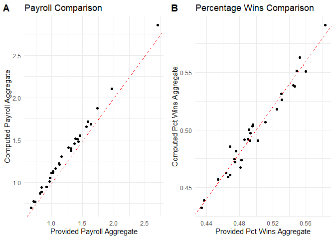
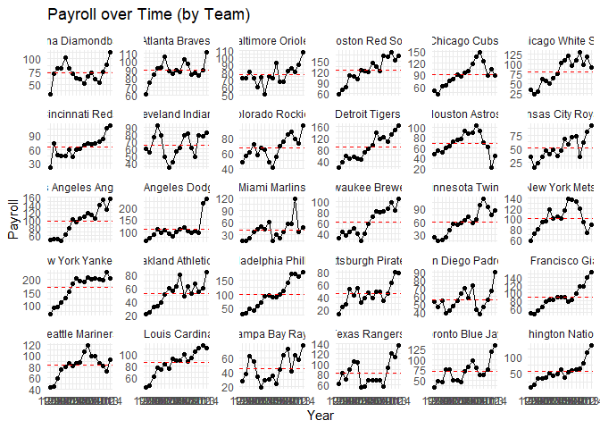
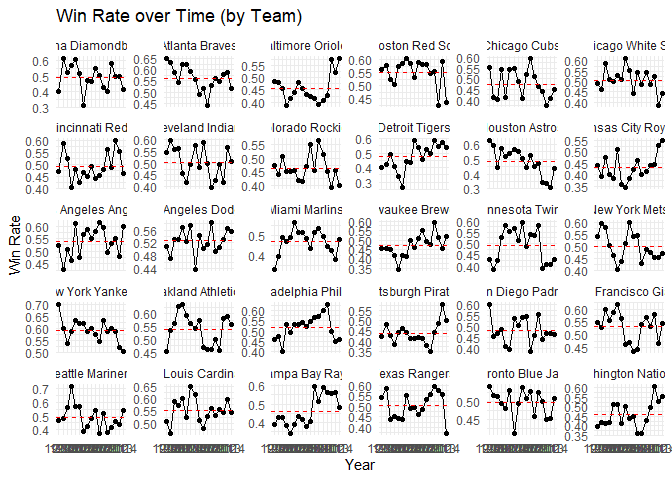
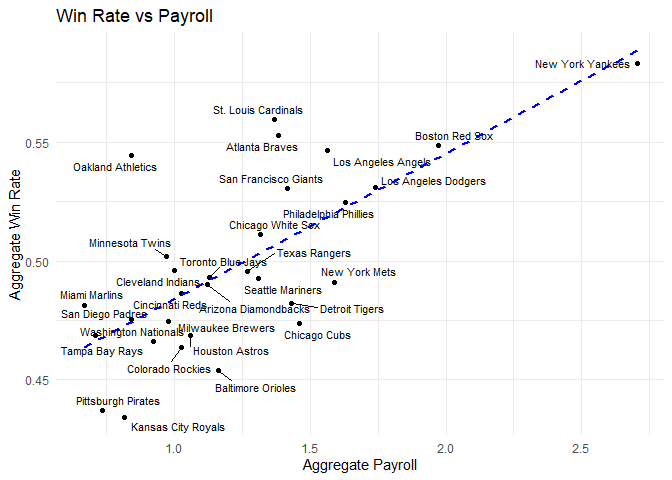

DSC1107: Formative Assessment 2
================
MAYOL, JOSE RAPHAEL J.
2025-02-23

# Case study: Major League Baseball

What is the relationship between payroll and wins among Major League
Baseball (MLB) teams? In this homework, we’ll find out by wrangling,
exploring, and modeling the dataset in MLPayData_Total.rdata, which
contains the winning records and the payroll data of all 30 MLB teams
from 1998 to 2014.

The dataset has the following variables:

- payroll: total team payroll (in billions of dollars) over the 17-year
  period

- avgwin: the aggregated win percentage over the 17-year period

- Team.name.2014: the name of the team

- p1998, . . . , p2014: payroll for each year (in millions of dollars)

- X1998, . . . , X2014: number of wins for each year

- X1998.pct, . . . , X2014.pct: win percentage for each year

We’ll need to use the following R packages:

``` r
library(tidyverse) # tidyverse
```

    ## ── Attaching core tidyverse packages ──────────────────────── tidyverse 2.0.0 ──
    ## ✔ dplyr     1.1.4     ✔ readr     2.1.5
    ## ✔ forcats   1.0.0     ✔ stringr   1.5.1
    ## ✔ ggplot2   3.5.1     ✔ tibble    3.2.1
    ## ✔ lubridate 1.9.4     ✔ tidyr     1.3.1
    ## ✔ purrr     1.0.2     
    ## ── Conflicts ────────────────────────────────────────── tidyverse_conflicts() ──
    ## ✖ dplyr::filter() masks stats::filter()
    ## ✖ dplyr::lag()    masks stats::lag()
    ## ℹ Use the conflicted package (<http://conflicted.r-lib.org/>) to force all conflicts to become errors

``` r
library(ggrepel) # for scatter plot point labels
library(kableExtra) # for printing tables
```

    ## 
    ## Attaching package: 'kableExtra'
    ## 
    ## The following object is masked from 'package:dplyr':
    ## 
    ##     group_rows

``` r
library(cowplot) # for side by side plots
```

    ## 
    ## Attaching package: 'cowplot'
    ## 
    ## The following object is masked from 'package:lubridate':
    ## 
    ##     stamp

# 1 Wrangle (35 points for correctness; 5 points for presentation)

## 1.1 Import (5 points)

- Import the data into a tibble called mlb_raw and print it.

- How many rows and columns does the data have?

- Does this match up with the data description given above?

**Solution.**

``` r
load('ml_pay.rdata')
mlb_raw <- as_tibble(ml_pay)
mlb_raw
```

    ## # A tibble: 30 × 54
    ##    payroll avgwin Team.name.2014 p1998 p1999 p2000 p2001 p2002 p2003 p2004 p2005
    ##      <dbl>  <dbl> <fct>          <dbl> <dbl> <dbl> <dbl> <dbl> <dbl> <dbl> <dbl>
    ##  1   1.12   0.490 Arizona Diamo…  31.6  70.5  81.0  81.2 103.   80.6  70.2  63.0
    ##  2   1.38   0.553 Atlanta Braves  61.7  74.9  84.5  91.9  93.5 106.   88.5  85.1
    ##  3   1.16   0.454 Baltimore Ori…  71.9  72.2  81.4  72.4  60.5  73.9  51.2  74.6
    ##  4   1.97   0.549 Boston Red Sox  59.5  71.7  77.9 110.  108.   99.9 125.  121. 
    ##  5   1.46   0.474 Chicago Cubs    49.8  42.1  60.5  64.0  75.7  79.9  91.1  87.2
    ##  6   1.32   0.511 Chicago White…  35.2  24.5  31.1  62.4  57.1  51.0  65.2  75.2
    ##  7   1.02   0.486 Cincinnati Re…  20.7  73.3  46.9  45.2  45.1  59.4  43.1  59.7
    ##  8   0.999  0.496 Cleveland Ind…  59.5  54.4  75.9  92.0  78.9  48.6  34.6  41.8
    ##  9   1.03   0.463 Colorado Rock…  47.7  55.4  61.1  71.1  56.9  67.2  64.6  47.8
    ## 10   1.43   0.482 Detroit Tigers  19.2  35.0  58.3  49.8  55.0  49.2  46.4  69.0
    ## # ℹ 20 more rows
    ## # ℹ 43 more variables: p2006 <dbl>, p2007 <dbl>, p2008 <dbl>, p2009 <dbl>,
    ## #   p2010 <dbl>, p2011 <dbl>, p2012 <dbl>, p2013 <dbl>, p2014 <dbl>,
    ## #   X2014 <int>, X2013 <int>, X2012 <int>, X2011 <int>, X2010 <int>,
    ## #   X2009 <int>, X2008 <int>, X2007 <int>, X2006 <int>, X2005 <int>,
    ## #   X2004 <int>, X2003 <int>, X2002 <int>, X2001 <int>, X2000 <int>,
    ## #   X1999 <int>, X1998 <int>, X2014.pct <dbl>, X2013.pct <dbl>, …

**The data has 30 rows and 54 columns. This indeed matches with the
given description which also had 54 variables and 30 teams.**

## 1.2 Tidy (15 points)

The raw data are in a messy format: Some of the column names are hard to
interpret, we have data from different years in the same row, and both
year-by-year and aggregate data are present.

- Tidy the data into two separate tibbles: one called
  ***mlb_aggregate*** containing the aggregate data and another called
  ***mlb_yearly*** containing the year-by-year data. ***mlb_aggregate***
  should contain columns named *team*, *payroll_aggregate*,
  *pct_wins_aggregate* and ***mlb_yearly*** should contain columns named
  *team*, *year*, *payroll*, *pct_wins*, *num_wins*. Comment your code
  to explain each step.

- Print these two tibbles. How many rows do mlb_aggregate and mlb_yearly
  contain, and why?

\[Hint: For mlb_yearly, the main challenge is to extract the information
from the column names. To do so, you can pivot_longer all these column
names into one column called column_name, separate this column into
three called prefix, year, suffix, mutate prefix and suffix into a a new
column called tidy_col_name that takes values payroll, num_wins, or
pct_wins, and then pivot_wider to make the entries of tidy_col_name into
column names.\]

**Solution.**

``` r
mlb_aggregate <- mlb_raw %>%
  select(Team.name.2014,payroll,avgwin) %>% # select relevant columns
  rename(team = Team.name.2014, # renaming
         payroll_aggregate = payroll,
         pct_wins_aggregate = avgwin)
mlb_aggregate
```

    ## # A tibble: 30 × 3
    ##    team                 payroll_aggregate pct_wins_aggregate
    ##    <fct>                            <dbl>              <dbl>
    ##  1 Arizona Diamondbacks             1.12               0.490
    ##  2 Atlanta Braves                   1.38               0.553
    ##  3 Baltimore Orioles                1.16               0.454
    ##  4 Boston Red Sox                   1.97               0.549
    ##  5 Chicago Cubs                     1.46               0.474
    ##  6 Chicago White Sox                1.32               0.511
    ##  7 Cincinnati Reds                  1.02               0.486
    ##  8 Cleveland Indians                0.999              0.496
    ##  9 Colorado Rockies                 1.03               0.463
    ## 10 Detroit Tigers                   1.43               0.482
    ## # ℹ 20 more rows

``` r
mlb_yearly <- mlb_raw %>%
  select(Team.name.2014:X1998.pct) %>% # ignore data about aggregated information
  rename(team = Team.name.2014) %>% # rename to 'team'
  pivot_longer( # pivot_longer to 'column_name'
    cols = p1998:X1998.pct,
    names_to = "column_name"
  ) %>%
  separate(column_name, c("prefix", "year"), sep = 1) %>% # separate first letter
  separate(year, c("year", "suffix")) %>% # separate suffix
  mutate(tidy_col_name = case_when(
    prefix == "p" ~ "payroll", # 'p' prefix -> 'payroll'
    prefix == "X" & is.na(suffix) ~ "num_wins", # empty suffix -> 'num_wins'
    prefix == "X" & suffix == "pct" ~ "pct_wins" # 'pct' suffix -> 'pctm_wins'
  )) %>%
  subset(select = c(-prefix,-suffix)) %>% # remove redundant columns
  pivot_wider( # make entries of 'tidy_col_name' into column names
    names_from = "tidy_col_name",
    values_from = "value"
  )
```

    ## Warning: Expected 2 pieces. Missing pieces filled with `NA` in 1020 rows [1, 2, 3, 4, 5,
    ## 6, 7, 8, 9, 10, 11, 12, 13, 14, 15, 16, 17, 18, 19, 20, ...].

``` r
mlb_yearly
```

    ## # A tibble: 510 × 5
    ##    team                 year  payroll num_wins pct_wins
    ##    <fct>                <chr>   <dbl>    <dbl>    <dbl>
    ##  1 Arizona Diamondbacks 1998     31.6       65    0.399
    ##  2 Arizona Diamondbacks 1999     70.5      100    0.613
    ##  3 Arizona Diamondbacks 2000     81.0       85    0.525
    ##  4 Arizona Diamondbacks 2001     81.2       92    0.568
    ##  5 Arizona Diamondbacks 2002    103.        98    0.605
    ##  6 Arizona Diamondbacks 2003     80.6       84    0.519
    ##  7 Arizona Diamondbacks 2004     70.2       51    0.315
    ##  8 Arizona Diamondbacks 2005     63.0       77    0.475
    ##  9 Arizona Diamondbacks 2006     59.7       76    0.469
    ## 10 Arizona Diamondbacks 2007     52.1       90    0.552
    ## # ℹ 500 more rows

## 1.3 Quality Control (15 points)

It’s always a good idea to check whether a dataset is internally
consistent. In this case, we are given both aggregated and yearly data,
so we can check whether these match. To this end, carry out the
following steps:

- Create a new tibble called ***mlb_aggregate_computed*** based on
  aggregating the data in ***mlb_yearly***, containing columns named
  *team*, *payroll_aggregate_computed*, and
  *pct_wins_aggregate_computed*.

- Ideally, ***mlb_aggregate_computed*** would match ***mlb_aggregate***.
  To check whether this is the case, join these two tibbles into
  ***mlb_aggregate_joined*** (which should have five columns: *team*,
  *payroll_aggregate*, *pct_wins_aggregate*,
  *payroll_aggregate_computed*, and *pct_wins_aggregate_computed*.)

- Create scatter plots of *payroll_aggregate_computed* versus
  *payroll_aggregate* and *pct_wins_aggregate_computed* versus
  *pct_wins_aggregate*, including a $45^◦$ line in each. Display these
  scatter plots side by side, and comment on the relationship between
  the computed and provided aggregate statistics.

**Solution.**

``` r
mlb_aggregate_computed <- mlb_yearly %>%
  group_by(team) %>%
  summarise(
    payroll_aggregate_computed = sum(payroll)/1000,
    pct_wins_aggregate_computed = mean(pct_wins)
  )
mlb_aggregate_computed
```

    ## # A tibble: 30 × 3
    ##    team                 payroll_aggregate_computed pct_wins_aggregate_computed
    ##    <fct>                                     <dbl>                       <dbl>
    ##  1 Arizona Diamondbacks                       1.22                       0.492
    ##  2 Atlanta Braves                             1.52                       0.563
    ##  3 Baltimore Orioles                          1.31                       0.457
    ##  4 Boston Red Sox                             2.10                       0.551
    ##  5 Chicago Cubs                               1.55                       0.475
    ##  6 Chicago White Sox                          1.38                       0.507
    ##  7 Cincinnati Reds                            1.12                       0.491
    ##  8 Cleveland Indians                          1.11                       0.505
    ##  9 Colorado Rockies                           1.13                       0.463
    ## 10 Detroit Tigers                             1.48                       0.474
    ## # ℹ 20 more rows

``` r
mlb_aggregate_joined <- mlb_aggregate %>% 
  left_join(mlb_aggregate_computed, by = "team")
mlb_aggregate_joined
```

    ## # A tibble: 30 × 5
    ##    team              payroll_aggregate pct_wins_aggregate payroll_aggregate_co…¹
    ##    <fct>                         <dbl>              <dbl>                  <dbl>
    ##  1 Arizona Diamondb…             1.12               0.490                   1.22
    ##  2 Atlanta Braves                1.38               0.553                   1.52
    ##  3 Baltimore Orioles             1.16               0.454                   1.31
    ##  4 Boston Red Sox                1.97               0.549                   2.10
    ##  5 Chicago Cubs                  1.46               0.474                   1.55
    ##  6 Chicago White Sox             1.32               0.511                   1.38
    ##  7 Cincinnati Reds               1.02               0.486                   1.12
    ##  8 Cleveland Indians             0.999              0.496                   1.11
    ##  9 Colorado Rockies              1.03               0.463                   1.13
    ## 10 Detroit Tigers                1.43               0.482                   1.48
    ## # ℹ 20 more rows
    ## # ℹ abbreviated name: ¹​payroll_aggregate_computed
    ## # ℹ 1 more variable: pct_wins_aggregate_computed <dbl>

**As observed, the values of the given and computed aggregate values DO
NOT match.**

``` r
# Payroll Scatter plot
payroll_scatter <- ggplot(mlb_aggregate_joined, aes(x = payroll_aggregate, y = payroll_aggregate_computed)) +
  geom_point() +
  geom_abline(slope = 1, intercept = 0, linetype = "dashed", color = "red") +
  labs(title = "Payroll Comparison",
       x = "Provided Payroll Aggregate",
       y = "Computed Payroll Aggregate") +
  theme_minimal()

# Pct win Scatter plot
pct_win_scatter <- ggplot(mlb_aggregate_joined, aes(x = pct_wins_aggregate, y = pct_wins_aggregate_computed)) +
  geom_point() +
  geom_abline(slope = 1, intercept = 0, linetype = "dashed", color = "red") +
  labs(title = "Percentage Wins Comparison",
       x = "Provided Pct Wins Aggregate",
       y = "Computed Pct Wins Aggregate") +
  theme_minimal()

# Merged
combined_plot <- plot_grid(payroll_scatter, pct_win_scatter, labels = "AUTO", ncol = 2)
combined_plot
```

<!-- -->

**The two scatterplots both show a strong correlation between their
computed and provided statistics. Ideally, these should be exactly equal
with each other; this is not the case here. Accuracy losses during
rounding may have hampered the quality of the aggregates provided by the
raw dataset. The payroll scatter plot shows points that are clustered
very closely to the y=x line, while the pct wins graph have noticeably
more variations in their placements. This goes to show that the provided
payroll aggregates were more accurate, although still not exact.**

# 2 Explore (50 points for correctness; 10 points for presentation)

Now that the data are in tidy format, we can explore them by producing
visualizations and summary statistics.

## 2.1 Payroll across years (15 points)

- Plot *payroll* as a function of *year* for each of the 30 teams,
  faceting the plot by *team* and adding a red dashed horizontal line
  for the mean payroll across years of each team.

- Using dplyr, identify the three teams with the greatest
  *payroll_aggregate_computed*, and print a table of these teams and
  their *payroll_aggregate_computed*.

- Using dplyr, identify the three teams with the greatest percentage
  increase in payroll from 1998 to 2014 (call it *pct_increase*), and
  print a table of these teams along with *pct_increase* as well as
  their payroll figures from 1998 and 2014.

- How are the metrics *payroll_aggregate_computed* and *pct_increase*
  reflected in the plot above, and how can we see that the two sets of
  teams identified above are the top three in terms of these metrics?

\[Hint: To compute payroll increase, it’s useful to pivot_wider the data
back to a format where different years are in different columns. Use
*names_prefix = “payroll\_”* inside pivot_wider to deal with the fact
column names cannot be numbers. To add different horizontal lines to
different facets, see this webpage.\]

**Solution.**

``` r
# Payroll over Time
payroll_over_time <- mlb_yearly %>%
  group_by(team) %>%
  mutate(mean_payroll = mean(payroll, na.rm = TRUE)) %>%
  ggplot(aes(x = year, y = payroll, group = team)) +
  geom_line() +
  geom_point() +
  geom_hline(aes(yintercept = mean_payroll), linetype = "dashed", color = "red") +
  facet_wrap(~ team, scales = "free_y") +
  theme_minimal() +
  labs(
    title = "Payroll over Time (by Team)",
    x = "Year",
    y = "Payroll"
  )
payroll_over_time
```

<!-- -->

``` r
# Top 3 Highest Total Payroll
top_teams <- mlb_aggregate_joined %>%
  arrange(desc(payroll_aggregate_computed)) %>%
  slice_head(n = 3) %>%
  select(team, payroll_aggregate_computed)

top_teams %>%
  kable()
```

| team                | payroll_aggregate_computed |
|:--------------------|---------------------------:|
| New York Yankees    |                   2.857093 |
| Boston Red Sox      |                   2.103581 |
| Los Angeles Dodgers |                   1.874194 |

**The *New York Yankees*, *Boston Red Sox*, and *Los Angeles Dodgers*
are the teams with the highest total payroll aggregates.**

``` r
# Top 3 Highest Payroll Increase
top_pct_increase <- mlb_yearly %>%
  subset(select = c(-num_wins, -pct_wins)) %>%
  filter(year %in% c(1998, 2014)) %>%
  pivot_wider(names_from = year, values_from = payroll, names_prefix = "payroll_") %>%
  mutate(pct_increase = (payroll_2014 - payroll_1998) / payroll_1998 * 100) %>%
  arrange(desc(pct_increase)) %>%
  slice_head(n = 3) %>%
  select(team, payroll_1998, payroll_2014, pct_increase)

top_pct_increase %>%
  kable()
```

| team                  | payroll_1998 | payroll_2014 | pct_increase |
|:----------------------|-------------:|-------------:|-------------:|
| Washington Nationals  |       8.3170 |     134.7044 |    1519.6277 |
| Detroit Tigers        |      19.2375 |     162.2285 |     743.2932 |
| Philadelphia Phillies |      28.6225 |     180.0527 |     529.0601 |

**The *Washington Nationals*, *Detroit Tigers*, and *Philadelphia
Phillies* are the 3 teams which had the biggest improvements in payroll
amounts from 1998 to 2014.**

- How are the metrics *payroll_aggregate_computed* and *pct_increase*
  reflected in the plot above, and how can we see that the two sets of
  teams identified above are the top three in terms of these metrics?

**From the Payroll-over-Time graphs for each team,
*payroll_aggregate_computed* relates with how high the red lines are.
Since these red lines represent the mean yearly payrolls for the teams,
then high placements should also translate to bigger total amounts. The
New York Yankees have a much higher red line than the others and is thus
reflected in their total payroll. The other top teams also all have red
lines that are higher than the 100 mark.**

**Another metric that connects with the graphs is the *pct_increase*.
All of the top 3 teams with the biggest payroll increases have graphs
which start incredibly low but finish at a height much greater than
before. In other words, they have ‘thick’ graphs. Notice that none of
the three teams with the highest total payrolls are also included in the
list for top increases. While not impossible, it is much harder to see a
substantial increase for teams with big total payrolls since they tend
to start and also finish high.**

## 2.2 Win percentage across years (15 points)

- Plot *pct_wins* as a function of year for each of the 30 teams,
  faceting the plot by *team* and adding a red dashed horizontal line
  for the average *pct_wins* across years of each team.

- Using dplyr, identify the three teams with the greatest
  *pct_wins_aggregate_computed* and print a table of these teams along
  with *pct_wins_aggregate_computed*.

- Using dplyr, identify the three teams with the most erratic *pct_wins*
  across years (as measured by the standard deviation, call it
  *pct_wins_sd*) and print a table of these teams along with
  *pct_wins_sd*.

- How are the metrics *pct_wins_aggregate_computed* and *pct_wins_sd*
  reflected in the plot above, and how can we see that the two sets of
  teams identified above are the top three in terms of these metrics?

**Solution.**

``` r
# Win Rate over Time
winrate_over_time <- mlb_yearly %>%
  group_by(team) %>%
  mutate(mean_winrate = mean(pct_wins, na.rm = TRUE)) %>%
  ggplot(aes(x = year, y = pct_wins, group = team)) +
  geom_line() +
  geom_point() +
  geom_hline(aes(yintercept = mean_winrate), linetype = "dashed", color = "red") +
  facet_wrap(~ team, scales = "free_y") +
  theme_minimal() +
  labs(
    title = "Win Rate over Time (by Team)",
    x = "Year",
    y = "Win Rate"
  )
winrate_over_time
```

<!-- -->

``` r
# Top 3 Highest AVG Win Rate
top_wr <- mlb_aggregate_joined %>%
  arrange(desc(pct_wins_aggregate_computed)) %>%
  slice_head(n = 3) %>%
  select(team, pct_wins_aggregate_computed)

top_wr %>%
  kable()
```

| team             | pct_wins_aggregate_computed |
|:-----------------|----------------------------:|
| New York Yankees |                   0.5909819 |
| Atlanta Braves   |                   0.5631539 |
| Boston Red Sox   |                   0.5512860 |

**The *New York Yankees*, *Atlanta Braves*, and *Boston Red Sox* are the
teams with the highest average win rates.**

``` r
# Top 3 Most Erratic Win Rates
erratic_teams <- mlb_yearly %>%
  group_by(team) %>%
  summarise(pct_wins_sd = sd(pct_wins, na.rm = TRUE)) %>%
  arrange(desc(pct_wins_sd)) %>%
  slice_head(n = 3)

erratic_teams %>%
  kable()
```

| team             | pct_wins_sd |
|:-----------------|------------:|
| Houston Astros   |   0.0914336 |
| Detroit Tigers   |   0.0897654 |
| Seattle Mariners |   0.0892271 |

**The *Houston Astros*, *Detroit Tigers*, and *Seattle Mariners* are the
3 teams which had the most erratic win rates from 1998 to 2014.**

- How are the metrics *pct_wins_aggregate_computed* and *pct_wins_sd*
  reflected in the plot above, and how can we see that the two sets of
  teams identified above are the top three in terms of these metrics?

**In this plot, the *pct_wins_aggregate_computed* is exactly equal to
the red line of each graph since they are both the average win rate of
each team.**

**Meanwhile, the *pct_wins_sd* metric relates to how ‘scattered’ the
points of the win rates are. The top 3 teams with the most erratic win
rates have the graphs which also look the most irregular when compared
with the others. They also have many points that are far from the mean
at highly varying levels.**

## 2.3 Win percentage versus payroll (15 points)

- Create a scatter plot of *pct_wins* versus *payroll* based on the
  aggregated data, labeling each point with the team name using
  geom_text_repel from the ggrepel package and adding the least squares
  line.

- Is the relationship between payroll and pct_wins positive or negative?
  Is this what you would expect, and why?

**Solution.**

``` r
# WinRate-Payroll Scatter plot
wr_payroll_scatter <- mlb_aggregate_joined %>%
  ggplot(aes(x = payroll_aggregate, y = pct_wins_aggregate)) +
  geom_point() +
  geom_text_repel(aes(label = team), size = 3, max.overlaps = Inf) +
  geom_smooth(method = "lm", se = FALSE, linetype = "dashed", color = "blue") +
  theme_minimal() +
  labs(
    title = "Win Rate vs Payroll",
    x = "Aggregate Payroll",
    y = "Aggregate Win Rate"
  )

wr_payroll_scatter
```

    ## `geom_smooth()` using formula = 'y ~ x'

<!-- -->

**Since the line is heading NE, then the relationship between win rate
and payroll is POSITIVE. This implies that teams that win more will
receive higher payrolls than those who have more losses. In concept, it
makes perfect sense to have this kind of relationship between win rate
and payroll since it rewards exceptional performance with better pay. It
also incentivizes players to work harder and become better athletes in
general.**

## Team efficiency (5 points)

Define a team’s efficiency as the ratio of the aggregate win percentage
to the aggregate payroll—more efficient teams are those that win more
with less money.

- Using dplyr, identify the three teams with the greatest efficiency,
  and print a table of these teams  
  along with their efficiency, as well as their
  *pct_wins_aggregate_computed* and *payroll_aggregate_computed*.

- In what sense do these three teams appear efficient in the previous
  plot?

Side note: The movie “Moneyball” portrays “Oakland A’s general manager
Billy Beane’s successful attempt to assemble a baseball team on a lean
budget by employing computer-generated analysis to acquire new players.”

**Solution.**

``` r
# Top 3 Most Efficient
efficiency_teams <- mlb_aggregate_joined %>%
  mutate(efficiency = pct_wins_aggregate_computed / payroll_aggregate_computed) %>%
  arrange(desc(efficiency)) %>%
  slice_head(n = 3) %>%
  select(team, efficiency, pct_wins_aggregate_computed, payroll_aggregate_computed)

efficiency_teams %>%
  kable()
```

| team | efficiency | pct_wins_aggregate_computed | payroll_aggregate_computed |
|:---|---:|---:|---:|
| Miami Marlins | 0.6694182 | 0.4673161 | 0.6980929 |
| Oakland Athletics | 0.6067658 | 0.5385489 | 0.8875729 |
| Tampa Bay Rays | 0.5939731 | 0.4610341 | 0.7761869 |

**The 3 most efficient teams are the *Miami Marlins*, *Oakland
Athletics*, and *Tampa Bay Rays*. In the Win Rate Vs. Payroll graph, all
of these teams are positioned above the regression line (higher on the
Aggregate Win Rate axis) and on the left of the plot (lower on the
Aggregate Payroll axis). This means that they deliver sufficient win
rates while requiring less financial resources, especially when compared
to the high cost-reward situation of the New York Yankees. Admittedly,
this definition of efficiency is not perfect, but it provides a
relatively safe starting point for analyzing the performances of Major
League Baseball teams.**
