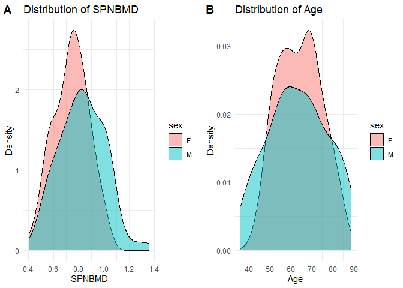
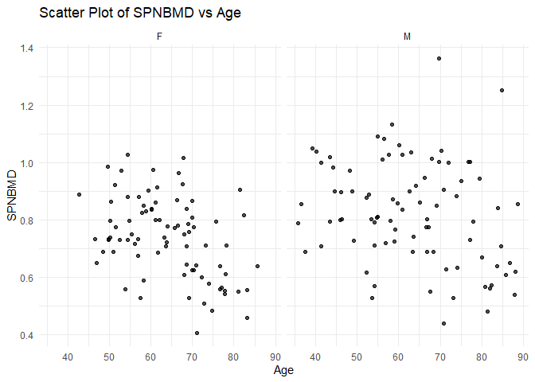
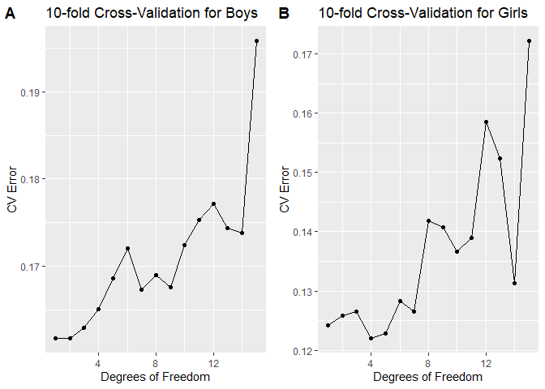
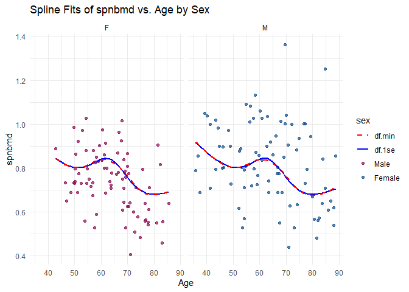
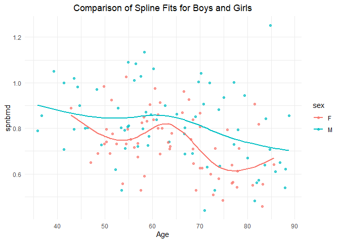
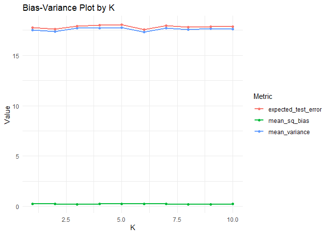
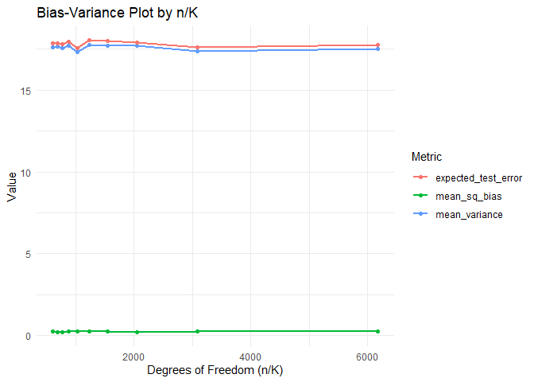
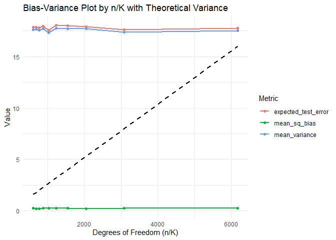

FA4
================
MAYOL, JOSE RAPHAEL J.
2025-03-07

We’ll need to use the following R packages:

``` r
library(tidyverse) # tidyverse
```

    ## ── Attaching core tidyverse packages ──────────────────────── tidyverse 2.0.0 ──
    ## ✔ dplyr     1.1.4     ✔ readr     2.1.5
    ## ✔ forcats   1.0.0     ✔ stringr   1.5.1
    ## ✔ ggplot2   3.5.1     ✔ tibble    3.2.1
    ## ✔ lubridate 1.9.4     ✔ tidyr     1.3.1
    ## ✔ purrr     1.0.2     
    ## ── Conflicts ────────────────────────────────────────── tidyverse_conflicts() ──
    ## ✖ dplyr::filter() masks stats::filter()
    ## ✖ dplyr::lag()    masks stats::lag()
    ## ℹ Use the conflicted package (<http://conflicted.r-lib.org/>) to force all conflicts to become errors

``` r
library(readxl) # for reading Excel files
library(knitr) # for include_graphics()
library(kableExtra) # for printing tables
```

    ## 
    ## Attaching package: 'kableExtra'
    ## 
    ## The following object is masked from 'package:dplyr':
    ## 
    ##     group_rows

``` r
library(cowplot) # for side by side plots
```

    ## 
    ## Attaching package: 'cowplot'
    ## 
    ## The following object is masked from 'package:lubridate':
    ## 
    ##     stamp

``` r
library(FNN) # for K-nearest-neighbors regression
library(stat471) # for cross_validate_spline()
```

# 1. Case study: Bone mineral density (30 points for correctness; 7 points for presentation)

In this exercise, we will be looking at a data set (given in
bmd-data.xlsx, see Canvas: FA 4 for the dataset file location) on spinal
bone mineral density, a physiological indicator that increases during
puberty when a child grows. In this dataset, idnum is an identifier for
each child and spnbmd represents the relative change in spinal bone
mineral density between consecutive doctor’s visits.

  
The goal is to learn about the typical trends of growth in bone mineral
density during puberty for boys and girls.

## 1.1 Import (2 points)

Since the data are in Excel format, the functions in readr are
insufficient to import it. Instead, you must use readxl, another
tidyverse package. Familiarize yourself with readxl by referring to the
data import cheat sheet or the package website.

1.  Using the readxl package, import the data into a tibble called
    bmd_raw.

2.  Print the imported tibble.

**Solution.**

``` r
bmd_raw <- read_excel('bmd-data.xlsx')
bmd_raw
```

    ## # A tibble: 169 × 9
    ##    idnum   age sex   fracture weight_kg height_cm medication waiting_time spnbmd
    ##    <dbl> <dbl> <chr> <chr>        <dbl>     <dbl> <chr>             <dbl>  <dbl>
    ##  1   469  57.1 F     no frac…        64      156. Anticonvu…           18  0.879
    ##  2  8724  75.7 F     no frac…        78      162  No medica…           56  0.795
    ##  3  6736  70.8 M     no frac…        73      170. No medica…           10  0.907
    ##  4 24180  78.2 F     no frac…        60      148  No medica…           14  0.711
    ##  5 17072  54.2 M     no frac…        55      161  No medica…           20  0.791
    ##  6  3806  77.2 M     no frac…        65      168  No medica…            7  0.730
    ##  7 17106  56.2 M     no frac…        77      159  No medica…           26  1.01 
    ##  8 23834  49.9 F     no frac…        59      150  No medica…            9  0.731
    ##  9  2454  68.4 M     no frac…        64      167  Glucocort…            6  0.689
    ## 10  2088  66.3 M     no frac…        72      160. No medica…           10  0.947
    ## # ℹ 159 more rows

## 1.2 Tidy (2 points)

1.  Comment on the layout of the data in the tibble. What should be the
    variables in the data? What  
    operation is necessary to get it into tidy format?

2.  Apply this operation to the data, storing the result in a tibble
    called bmd.

**Solution.**

**The variables are in the columns, the observations are in the rows,
and the values are in the cells. Each row represents a unique
observation and every column consists of information for exactly one
variable. This data is already tidy. No further intervention will be
done aside from storing into a new tibble.**

``` r
bmd <- bmd_raw
```

## 1.3 Explore (6 points)

1.  What is the total number of children in this dataset? What are the
    number of boys and girls? What  
    are the median ages of these boys and girls?

2.  Produce plots to compare the distributions of *spnbmd* and *age*
    between boys and girls (display these  
    as two plots side by side, one for *spnbmd* and one for *age*). Are
    there apparent differences in either  
    *spnbmd* or *age* between these two groups?

3.  Create a scatter plot of *spnbmd* (y axis) versus *age* (x axis),
    faceting by gender. What trends do you  
    see in this data?

**Solution.**

``` r
bmd %>%
  summarise(total_count = n())
```

    ## # A tibble: 1 × 1
    ##   total_count
    ##         <int>
    ## 1         169

**There are a total of 169 children.**

``` r
bmd %>%
  group_by(sex) %>%
  summarise(
    count = n(),
    median_age = median(age, na.rm = TRUE)
  )
```

    ## # A tibble: 2 × 3
    ##   sex   count median_age
    ##   <chr> <int>      <dbl>
    ## 1 F        83       63.8
    ## 2 M        86       63.2

**There are 83 girls and 86 boys and their median ages are 63.76954 &
63.23333 months, respectively.**

``` r
plot_spnbmd <- ggplot(bmd, aes(x = spnbmd, fill = sex)) +
  geom_density(alpha = 0.5) +
  labs(title = "Distribution of SPNBMD", x = "SPNBMD", y = "Density") +
  theme_minimal()

plot_age <- ggplot(bmd, aes(x = age, fill = sex)) +
  geom_density(alpha = 0.5) +
  labs(title = "Distribution of Age", x = "Age", y = "Density") +
  theme_minimal()

cowplot::plot_grid(plot_spnbmd, plot_age, labels = "AUTO")
```

<!-- -->

**The distribution of both spnbmd and age among girls is much taller in
the center compared to the boys. This implies that there is a
considerably lesser amount of extremes in the girls group.**

``` r
scatter_spnbmd_age <- ggplot(bmd, aes(x = age, y = spnbmd)) +
  geom_point(alpha = 0.7) +
  facet_wrap(~ sex) +
  labs(title = "Scatter Plot of SPNBMD vs Age", x = "Age", y = "SPNBMD") +
  theme_minimal()
scatter_spnbmd_age
```

<!-- -->

**We can observe that there is a slight downward trend in spnbmd among
girls as they increase in age. The points also cluster around the
0.7-0.9 mark around the ages 50-70. On the other hand, the spnbmd data
for the boys also have an inverse relationship with age but are much
more varied and have no clear pattern. Their spnbmd are also overall
higher than the girls. The boys also have some points which are much
higher than the others, suggesting the presence of outliers.**

## 1.4 Model (12 points)

There are clearly some trends in this data, but they are somewhat hard
to see given the substantial amount of variability. This is where
splines come in handy.

### 1.4.1 Split (1 point)

To ensure unbiased assessment of predictive models, let’s split the data
before we start modeling it.

1.  Split bmd into training (80%) and test (20%) sets, using the rows in
    *train_samples* below for training. Store these in tibbles called
    *bmd_train* and *bmd_test*, respectively.

``` r
set.seed(5) # seed set for reproducibility (DO NOT CHANGE)
n <- nrow(bmd)
train_samples <- sample(1:n, round(0.8*n))
```

**Solution.**

``` r
bmd_train <- bmd[train_samples, ]
bmd_test <- bmd[-train_samples, ]
```

### 1.4.2 Tune (10 points)

1.  Since the trends in spnbmd look somewhat different for boys than for
    girls, we might want to fit separate splines to these two groups.
    Separate *bmd_train* into *bmd_train_male* and *bmd_train_female*,
    and likewise for *bmd_test*

**Solution.**

``` r
bmd_train_male <- subset(bmd_train, sex == "M")
bmd_train_female <- subset(bmd_train, sex == "F")

bmd_test_male <- subset(bmd_test, sex == "M")
bmd_test_female <- subset(bmd_test, sex == "F")
```

2.  Using *cross_validate_spline* from the stat471 R package, perform
    10-fold cross-validation on  
    *bmd_train_male* and *bmd_train_female*, trying degrees of freedom
    1,2,. . . ,15. Display the two resulting CV plots side by side.

**Solution.**

``` r
lsf.str("package:stat471")
```

    ## hw_471 : function (documentclass = "hw_471", fig_width = 4, fig_height = 2.5, fig_crop = TRUE, 
    ##     dev = "pdf", highlight = "default", template = template_resources("hw_471", 
    ##         "template.tex"), ...)  
    ## list_data : function ()  
    ## tidy_ml_data : function ()  
    ## update_471 : function ()

**As we can see, there is no *cross_validate_spline* function that
exists with the stat471 package. Hence, we have to make our own.**

``` r
library(splines)
library(caret)
```

    ## Warning: package 'caret' was built under R version 4.4.3

    ## Loading required package: lattice

    ## 
    ## Attaching package: 'caret'

    ## The following object is masked from 'package:purrr':
    ## 
    ##     lift

``` r
cross_validate_spline <- function(data, k, df_range, response, predictor) {
  results <- data.frame(df = df_range, cv_error = numeric(length(df_range)))
  
  for (df in df_range) {
    model <- train(
      as.formula(paste(response, "~", paste(predictor, collapse = "+"), "+ ns(", predictor, ", df = ", df, ")")),
      data = data,
      method = "lm",
      trControl = trainControl(method = "cv", number = k),
      metric = "RMSE"
    )
    results$cv_error[df] <- mean(model$results$RMSE)
  }
  return(results)
}

cv_results_male <- cross_validate_spline(bmd_train_male, k = 10, df_range = 1:15, response = "spnbmd", predictor = "age")
cv_results_female <- cross_validate_spline(bmd_train_female, k = 10, df_range = 1:15, response = "spnbmd", predictor = "age")

plot_male <- ggplot(cv_results_male, aes(x = df, y = cv_error)) +
  geom_line() +
  geom_point() +
  labs(title = "10-fold Cross-Validation for Boys", x = "Degrees of Freedom", y = "CV Error")

plot_female <- ggplot(cv_results_female, aes(x = df, y = cv_error)) +
  geom_line() +
  geom_point() +
  labs(title = "10-fold Cross-Validation for Girls", x = "Degrees of Freedom", y = "CV Error")

cowplot::plot_grid(plot_male, plot_female, labels = "AUTO")
```

<!-- -->

3.  What are the degrees of freedom values minimizing the CV curve for
    boys and girls, and what are the values obtained from the one
    standard error rule?

**Solution.**

**The optimal dof which gives the least error is 2 for boys and 4 for
girls based on the graph.**

``` r
one_se_rule <- function(cv_results) {
  min_cv_error <- min(cv_results$cv_error)
  se_cv_error <- sd(cv_results$cv_error) / sqrt(length(cv_results$cv_error))
  threshold <- min_cv_error + se_cv_error
  
  best_df <- max(cv_results$df[cv_results$cv_error <= threshold])
  return(best_df)
}

best_df_male <- one_se_rule(cv_results_male)
best_df_female <- one_se_rule(cv_results_female)

cat("Best degrees of freedom for boys:", best_df_male, "\n")
```

    ## Best degrees of freedom for boys: 3

``` r
cat("Best degrees of freedom for girls:", best_df_female, "\n")
```

    ## Best degrees of freedom for girls: 5

**From the one standard error rule, we get that the optimal dof are now
3 for boys and 5 for girls.**

4.  For the sake of simplicity, let’s use the same degrees of freedom
    for males as well as females. Define  
    *df.min* to be the maximum of the two *df.min* values for males and
    females, and define *df.1se* likewise.  
    Add these two spline fits to the scatter plot of *spnbmd* (y axis)
    versus *age* (x axis), faceting by *gender*.

**Solution.**

``` r
df.min <- max(2, 4)
df.1se <- max(3, 5)

spline_fit_min <- lm(spnbmd ~ ns(age, df = df.min), data = bmd)
spline_fit_1se <- lm(spnbmd ~ ns(age, df = df.1se), data = bmd)

bmd$pred_min <- predict(spline_fit_min, newdata = bmd)
bmd$pred_1se <- predict(spline_fit_1se, newdata = bmd)

scatter_spnbmd_age_new <- ggplot(bmd, aes(x = age, y = spnbmd, color = sex)) +
  geom_point(alpha = 0.7) +
  geom_line(aes(y = pred_min, color = "df.min"), linewidth = 1) +
  geom_line(aes(y = pred_1se, color = "df.1se"), linewidth = 1, linetype = "dashed") +
  facet_wrap(~ sex) +
  labs(title = "Spline Fits of spnbmd vs. Age by Sex",
       x = "Age", y = "spnbmd") +
  scale_color_manual(values = c("df.min" = "blue", "df.1se" = "red", "M" = "dodgerblue4", "F" = "deeppink4"),
                     labels = c("df.min", "df.1se", "Male", "Female")) +
  theme_minimal()

scatter_spnbmd_age_new
```

<!-- -->

5.  Given your intuition for what growth curves look like, which of
    these two values of the degrees of freedom makes more sense?

**Solution.**

**Since both values have similar outputs yet the value 4 also minimizes
the CV curve, then the dof value that makes the most sense is 4. Bone
density does indeed decrease with age, but it comes with fluctuations.
It is never perfectly linear. Moreover, the curve generated by dof value
of 4 reflects the general trend of the data itself.**

### 1.4.3 Final fit (1 point)

1.  Using the degrees of freedom chosen above, fit final spline models
    to *bmd_train_male* and  
    *bmd_train_female*.

``` r
spline_fit_male <- lm(spnbmd ~ ns(age, df = 4), data = bmd_train_male)
spline_fit_female <- lm(spnbmd ~ ns(age, df = 4), data = bmd_train_female)
```

## 1.5 Evaluate (2 points)

1.  Using the final models above, answer the following questions for
    boys and girls separately: What is the training RMSE? What is the
    test RMSE? Print these metrics in a nice table.

**Solution.**

``` r
pred_train_male <- predict(spline_fit_male, bmd_train_male)
pred_test_male <- predict(spline_fit_male, bmd_test_male)
rmse_train_male <- sqrt(mean((bmd_train_male$spnbmd - pred_train_male)^2))
rmse_test_male <- sqrt(mean((bmd_test_male$spnbmd - pred_test_male)^2))

pred_train_female <- predict(spline_fit_female, bmd_train_female)
pred_test_female <- predict(spline_fit_female, bmd_test_female)
rmse_train_female <- sqrt(mean((bmd_train_female$spnbmd - pred_train_female)^2))
rmse_test_female <- sqrt(mean((bmd_test_female$spnbmd - pred_test_female)^2))

rmse_table <- data.frame(
  Sex = c("Male", "Female"),
  Training_RMSE = c(rmse_train_male, rmse_train_female),
  Test_RMSE = c(rmse_test_male, rmse_test_female)
)

kable(rmse_table, caption = "RMSE for Boys and Girls")
```

| Sex    | Training_RMSE | Test_RMSE |
|:-------|--------------:|----------:|
| Male   |     0.1602206 | 0.2110503 |
| Female |     0.1152988 | 0.1278642 |

RMSE for Boys and Girls

2.  How do the training and test errors compare? What does this suggest
    about the extent of overfitting  
    that has occurred?

**Solution.**

**There are indeed discrepancies between the training and test errors
for both groups, but they are not too major. The female group in
particular has an exceptionally small gap in performance between the
training and unseen test data. Overfitting is more of a problem for the
male group and the difference is quite noticeable, but it is not yet
completely off. Overall, the model works satisfactorily with the males
and good for the females.**

## 1.6 Interpret (6 points)

1.  Using the degrees of freedom chosen above, redo the scatter plot
    with the overlaid spline fits, this time without faceting in order
    to directly compare the spline fits for boys and girls. Instead of
    faceting, distinguish the genders by color.

**Solution.**

``` r
bmd_combined <- bind_rows(
  bmd_train_male %>% mutate(sex = "M"),
  bmd_train_female %>% mutate(sex = "F")
)

bmd_combined <- bmd_combined %>%
  mutate(
    predicted_spnbmd = case_when(
      sex == "M" ~ predict(spline_fit_male, newdata = .),
      sex == "F" ~ predict(spline_fit_female, newdata = .)
    )
  )

ggplot(bmd_combined, aes(x = age, y = spnbmd, color = sex)) +
  geom_point(alpha = 0.7) +
  geom_line(aes(y = predicted_spnbmd), linewidth = 1) +
  labs(
    title = "Comparison of Spline Fits for Boys and Girls",
    x = "Age",
    y = "spnbmd",
    color = "sex"
  ) +
  theme_minimal() +
  theme(plot.title = element_text(hjust = 0.5))
```

<!-- -->

2.  The splines help us see the trend in the data much more clearly.
    Eyeballing these fitted curves, answer the following questions. At
    what ages (approximately) do boys and girls reach the peaks of their
    growth spurts? At what ages does growth largely level off for boys
    and girls? Do these seem in the right ballpark?

**Solution.**

**Both boys and girls reach the peaks of their growth spurts between the
60-65 ages. At age 80, bone density starts to slow down among boys but
starts to pick back up again among the girls. This phenomenon makes
sense when thinking about how estrogen levels start to stabilize and
growth slows down at the end of puberty for women. In this case, the
body, facilitated by estrogen secretion, will prioritize bone
lengthening since its growth does not outpace the deposition of minerals
anymore. It is good to note too that this second upward fluctuation is
much smaller than the initial spurt.**

# 2 KNN and bias-variance tradeoff (55 points for correctness; 8 points for presentation)

## Setup: Apple farming

You own a square apple orchard, measuring 200 meters on each side. You
have planted trees in a grid ten  
meters apart from each other. Last apple season, you measured the yield
of each tree in your orchard (in  
average apples per week). You noticed that the yield of the different
trees seems to be higher in some places of the orchard and lower in
others, perhaps due to differences in sunlight and soil fertility across
the orchard.

  
Unbeknownst to you, the yield Y of the tree planted E1 meters to the
right and E2 meters up from the  
bottom left-hand corner of the orchard has distribution
$Y=f(E)+\epsilon$, where

$\begin{equation*} f(E)=50+0.001E_1^2+0.001E_2^2,\epsilon\sim N(0,\sigma^2),\sigma=4 \end{equation*}$

The data you collected are as in Figure 1.

  
The underlying trend is depicted in Figure 2, with the top right-hand
corner of the orchard being more  
fruitful.

  
NOTE: Some of your answers for this question will include mathematical
expressions. Please see this page  
for a quick guide on how to write mathematical expressions in R
Markdown. Alternatively, you may write  
any mathematical derivations by hand, take photos of them, and include
the images in your writeup via  
*include_graphics()*.

## 2.1 A simple rule to predict this season’s yield (15 points)

This apple season is right around the corner, and you’d like to predict
the yield of each tree. You come up with perhaps the simplest possible
prediction rule: predict this year’s yield for any given tree based on
last year’s yield from that same tree. Without doing any programming,
answer the following questions:

1.  What is the training error of such a rule?

**Solution.**

$$
\begin{equation*}
\begin{split}
\text{Training error} &= \frac{1}{n}\sum_{i=1}^n(Y_i-\hat{Y_i})^2\\
&= \frac{1}{n}\sum_{i=1}^n(Y_i-{Y_{last year,i}})^2
\end{split}
\end{equation*}
$$

**Since it is given that** $Y_i=Y_{lastyear,i}=f(E)+\epsilon_i$
**then:**

$$
\begin{equation*}
\begin{split}
\text{Training error} &= \frac{1}{n}\sum_{i=1}^n(Y_i-{Y_{last year,i}})^2 \\
&= \frac{1}{n}\sum_{i=1}^n(f(E)+\epsilon_i-(f(E)+\epsilon_i))^2 \\
&= \frac{1}{n}\sum_{i=1}^n(0)^2 \\
&= \boxed{0}
\end{split}
\end{equation*}
$$

**Hence, the training error is 0.**

2.  What is the mean squared bias, mean variance, and expected test
    error of this prediction rule?

**Solution.**

$$
\begin{equation*}
\begin{split}
\text{Bias}^2 &= (\mathbb{E}[\hat{Y}]-f(E))^2 \\
&= (\mathbb{E}[Y]-f(E))^2 \\
&= (\mathbb{E}[f(E)+\epsilon]-f(E))^2 \\
&= (\mathbb{E}[f(E)]+\mathbb{E}[\epsilon]-f(E))^2 \\
&= (f(E)+0-f(E))^2 \\
&= \boxed{0}
\end{split}
\end{equation*}
$$

**Hence, the mean squared bias is 0.**

$$
\begin{equation*}
\begin{split}
\text{Variance} &= Var(\hat{Y}) \\
&= Var(Y) \\
&= Var(\epsilon) \\
&= 4^2 = \boxed{16}
\end{split}
\end{equation*}
$$

**Hence, the mean variance is 16.**

$$
\begin{equation*}
\begin{split}
\text{Expected Test Error} &= \text{Bias}^2 + Var(\hat{Y}) \\
&= 0 + 16 = \boxed{16}
\end{split}
\end{equation*}
$$

**Hence, the expected test error is 16.**

3.  Why is this not the best possible prediction rule?

**Solution.**

**The said prediction rule is not optimal since it includes**
$\epsilon$**, which is effectively fluctuating random noise in the data.
It also exhibits strong overfitting since it has 0 training error but 16
testing error.**

## 2.2 K-nearest neighbors regression (conceptual) (15 points)

As a second attempt to predict a yield for each tree, you average
together last year’s yields of the *K* trees closest to it (including
itself, and breaking ties randomly if necessary). So if you choose *K* =
1, you get back the simple rule from the previous section. This more
general rule is called *K-nearest neighbors (KNN) regression* (see ISLR
p. 105).

KNN is not a parametric model like linear or logistic regression, so it
is a little harder to pin down its degrees of freedom.

1.  What happens to the model complexity as *K* increases? Why?

**Solution.**

**As *K* increases, the model complexity decreases. This is because we
are averaging more nearby trees as *K* increases, leading to a model
with lesser variation. If *K*** **is equal to the total number of trees,
then there will be essentially no variation.**

2.  The degrees of freedom for KNN is sometimes considered *n/K*, where
    *n* is the training set size. Why might this be the case? \[Hint:
    consider a situation where the data are clumped in groups of *K*.\]

**Solution.**

**The degrees of freedom for KNN can be approximated as *n/K* since it
reflects how increasing *K* reduces the number of independent
predictions the model makes. When *K*** **= 1, each observation is
predicted individually (df = *n*), while at *K* = *n*, all observations
receive the same prediction (df = 1). As *K* increases, the model
smooths predictions over larger groups, effectively lowering the degrees
of freedom.**

3.  Conceptually, why might increasing *K* tend to improve the
    prediction rule? What does this have to do with the bias-variance
    tradeoff?

**Solution.**

**Increasing *K* tends to improve the prediction rule since doing so
reduces variance. This aligns with the bias-variance trade-off since
reducing variance (increasing *K*) comes with the price of introducing
some bias. Hence, increasing *K* is good for the initial phase when
there is too much variance and overfitting.**

4.  Conceptually, why might increasing *K* tend to worsen the prediction
    rule? What does this have to do with the bias-variance tradeoff?

**Solution.**

**As said in the previous answer, increasing *K* too much increases bias
and leads to underfitting. The resulting model could be too simplistic
and fail to capture the actual patterns in the data.**

## 2.3 K-nearest neighbors regression (simulation) (25 points)

Now, we try KNN for several values of *K*. For each value of *K*, we use
a numerical simulation to compute the bias and variance for every tree
in the orchard. These results are contained in
*training_results_summary* below.

``` r
training_results_summary <- readRDS("training_results_summary.rds")
training_results_summary
```

    ## # A tibble: 6,174 × 5
    ##        K    X1    X2    bias variance
    ##    <dbl> <dbl> <dbl>   <dbl>    <dbl>
    ##  1     1     0     0 -0.25       16.2
    ##  2     1     0    10  0.14       12.2
    ##  3     1     0    20 -0.523      20.4
    ##  4     1     0    30  0.109      15.6
    ##  5     1     0    40 -0.566      21.4
    ##  6     1     0    50 -0.336      15.9
    ##  7     1     0    60 -1.04       12.4
    ##  8     1     0    70 -0.0213     12.4
    ##  9     1     0    80  0.045      18.3
    ## 10     1     0    90 -0.312      14.7
    ## # ℹ 6,164 more rows

1.  Create a new tibble called *overall_results* the contains the mean
    squared bias, mean variance, and expected test error for each value
    of K. This tibble should have four columns: *K*, *mean_sq_bias*,
    *mean_variance*, and *expected_test_error*.

**Solution.**

``` r
overall_results <- training_results_summary %>%
  group_by(K) %>%
  summarise(
    mean_sq_bias = mean(bias^2),
    mean_variance = mean(variance),
    expected_test_error = mean_sq_bias + mean_variance
  )
overall_results
```

    ## # A tibble: 10 × 4
    ##        K mean_sq_bias mean_variance expected_test_error
    ##    <dbl>        <dbl>         <dbl>               <dbl>
    ##  1     1        0.280          17.5                17.8
    ##  2     2        0.256          17.4                17.6
    ##  3     3        0.227          17.7                17.9
    ##  4     4        0.264          17.7                18.0
    ##  5     5        0.255          17.8                18.0
    ##  6     6        0.252          17.3                17.6
    ##  7     7        0.244          17.7                18.0
    ##  8     8        0.232          17.6                17.8
    ##  9     9        0.232          17.6                17.9
    ## 10    10        0.240          17.6                17.9

2.  Using *overall_results*, plot the mean squared bias, mean variance,
    and expected test error on the same axes as a function of K. Based
    on this plot, what is the optimal value of K?

**Solution.**

``` r
overall_results_long <- overall_results %>%
  pivot_longer(cols = c(mean_sq_bias, mean_variance, expected_test_error), 
               names_to = "Metric", values_to = "Value")

plot_by_k <- ggplot(overall_results_long, aes(x = K, y = Value, color = Metric)) +
  geom_line(linewidth = 1) +
  geom_point() +
  labs(title = "Bias-Variance Plot by K",
       x = "K",
       y = "Value",
       color = "Metric") +
  theme_minimal()
plot_by_k
```

<!-- -->

**Since *expected_test_error* is lowest when K=6, then it must be the
optimal value.**

3.  We are used to the bias decreasing and the variance increasing when
    going from left to right in the plot. Here, the trend seems to be
    reversed. Why is this the case?

**Solution.**

**The noise or error term seems to be insignificant compared to the
dominant** $f(E)$ **function. In our plot, both bias and variance have
relatively consistent values all throughout. This could also be
attributed to** $f(E)$ **being smooth, thus even a small *K* will
provide an accurate estimation of the entirety.**

4.  The mean squared bias has a strange bump between K = 1 and K = 5,
    increasing from K = 1 to K = 2 but then decreasing from K = 2 to K
    = 5. Why does this bump occur? \[Hint: Think about the rectangular
    grid configuration of the trees. So for a given tree, the closest
    tree is itself, and then the next closest four trees are the ones
    that are one tree up, down, left, and right from it.\]

**Solution.**

**The expected bump in mean squared bias between** $K=1$ **and** $K=5$
**does not appear pronounced in the graph. Moreover, a tiny bump appears
from** $K=2$ **to** $K=4$ **unlike what the question suggests. This
absence of a considerable bump is likely due to the structured grid
layout of the orchard and the smoothness of** $f(E)$**. Since
neighboring trees, have similar yields, increasing *K* does not
introduce significant bias fluctuations as also said in the answer to
the previous question.**

5.  Based on the information in *training_results_summary*, which tree
    and which value of K gives the overall highest absolute bias? Does
    the sign of the bias make sense? Why do this particular tree and
    this particular value of K give us the largest absolute bias?

**Solution.**

``` r
most_bias_tree <- training_results_summary %>%
  mutate(abs_bias = abs(bias)) %>%
  arrange(desc(abs_bias)) %>%
  slice(1)

most_bias_tree
```

    ## # A tibble: 1 × 6
    ##       K    X1    X2  bias variance abs_bias
    ##   <dbl> <dbl> <dbl> <dbl>    <dbl>    <dbl>
    ## 1     1     0    70 -2.06     13.9     2.06

**The tree with the highest absolute bias is at (X1,X2)=(0,70). Its
negative bias makes sense because it implies that the model is
underestimating the yield at this location. Trees located further from
(0,0) such as this one tend to have higher yields, and if the model is
not fully capturing the expectation, then the bias will be highly
negative. This tree also has the highest absolute bias not only because
of its extreme location, but the *K* value prevents enough smoothing of
fluctuations to reduce sensitivity.**

6.  Redo the bias-variance plot from part 2, this time putting df = n/K
    on the x-axis. What do we notice about the variance as a function of
    df?

**Solution.**

``` r
num <- nrow(training_results_summary)
overall_results <- overall_results %>%
  mutate(df = num / K)

overall_results_long <- overall_results %>%
  pivot_longer(cols = c(mean_sq_bias, mean_variance, expected_test_error), 
               names_to = "Metric", values_to = "Value")

plot_by_df <- ggplot(overall_results_long, aes(x = df, y = Value, color = Metric)) +
  geom_line(linewidth = 1) +
  geom_point() +
  labs(title = "Bias-Variance Plot by n/K",
       x = "Degrees of Freedom (n/K)",
       y = "Value",
       color = "Metric") +
  theme_minimal()
plot_by_df
```

<!-- -->

**As expected, the variance behaves stable since the original plot by
*K* alone is already stable as it is. Increasing the value for the
x-axis by using *n/K* should flatten out the lines, but they were
already quite flat to begin with. However, one notable change that
happens is that the variance plot becomes extremely stable around the
3000 df mark. But overall, both variance graphs from before and the
current one have stable behaviors.**

7.  Derive a formula for the KNN mean variance. \[Hint: First, write
    down an expression for the KNN prediction for a given tree. Then,
    compute the variance of this quantity using the fact that the
    variance of the average of *N* independent random variables each
    with variance *s*<sup>2</sup> is *s*<sup>2</sup>*/N* . Finally,
    compute the mean variance by averaging over trees.\]

**Solution.**

**From our given yield function** $Y=f(E)+\epsilon$**, where**
$\epsilon\sim N(0,\sigma^2=16)$**, we get the following KNN prediction
equation:**

$$
\begin{equation*}
\begin{split}
\hat{Y}(E) &= \dfrac{1}{K}\sum_{x_i\in N_0}Y_i \\
&= \dfrac{1}{K}\sum_{x_i\in N_K(E)}(f(E_i)+\epsilon_i) \\
&= \dfrac{1}{K}\sum_{x_i\in N_K(E)}f(E_i)+\dfrac{1}{K}\sum_{x_i\in N_K(E)}\epsilon_i
\end{split}
\end{equation*}
$$

**For the variance,**

$$
\begin{equation*}
\begin{split}
Var(\hat{Y}(E)) &= Var(\dfrac{1}{K}\sum_{x_i\in N_K(E)}\epsilon_i) \\
&= Var(\dfrac{1}{K}\sum_{i=0}^K\epsilon_i) \\
&= \dfrac{\sigma^2}{K}
\end{split}
\end{equation*}
$$

**Since the derived variance is not dependent on E1 or E2, then**
$\text{Mean Variance}=\dfrac{\sigma^2}{K}$**.**

8.  Create a plot like that in part 6, but with the mean variance
    formula from part 7 superimposed as a dashed curve. Do these two
    variance curves match?

**Solution.**

``` r
overall_results <- overall_results %>%
  mutate(theoretical_variance = 16 / K) # from 4^2 = 16

overall_results_long <- overall_results %>%
  pivot_longer(cols = c(mean_sq_bias, mean_variance, expected_test_error), 
               names_to = "Metric", values_to = "Value")

plot_by_df2 <- ggplot(overall_results_long, aes(x = df, y = Value, color = Metric)) +
  geom_line(linewidth = 1) + 
  geom_point() + 
  geom_line(data = overall_results_long, aes(x = df, y = theoretical_variance), 
            linetype = "dashed", color = "black", linewidth = 1) + 
  labs(title = "Bias-Variance Plot by n/K with Theoretical Variance",
       x = "Degrees of Freedom (n/K)",
       y = "Value",
       color = "Metric") +
  theme_minimal()

plot_by_df2
```

<!-- -->

**The theoretical variance appears as a line that has a direct
relationship with** $df=n/K$**, matching perfectly with our expectation
of variance decreasing with higher *K* (also meaning lower *df*). This
curve does not match at all with the bias-variance plot from before, as
highlighted in the image above. Hence, the theoretical variance is not a
good fit for this dataset.**
