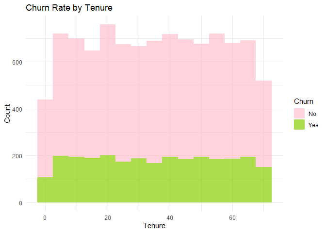
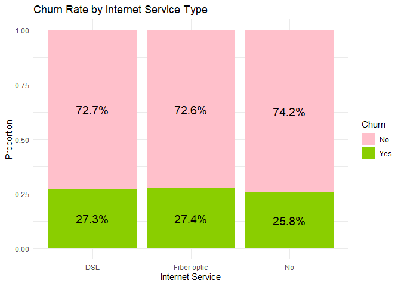
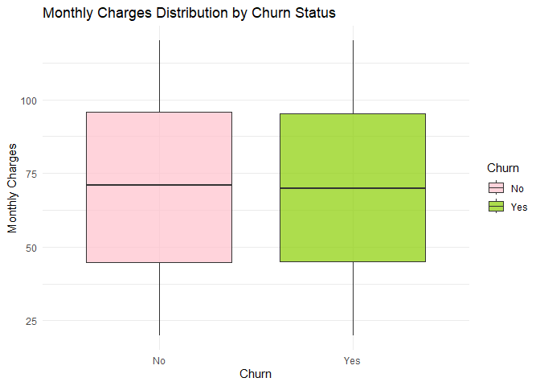
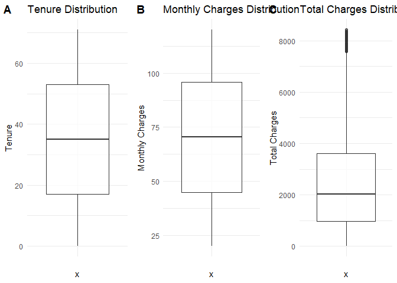
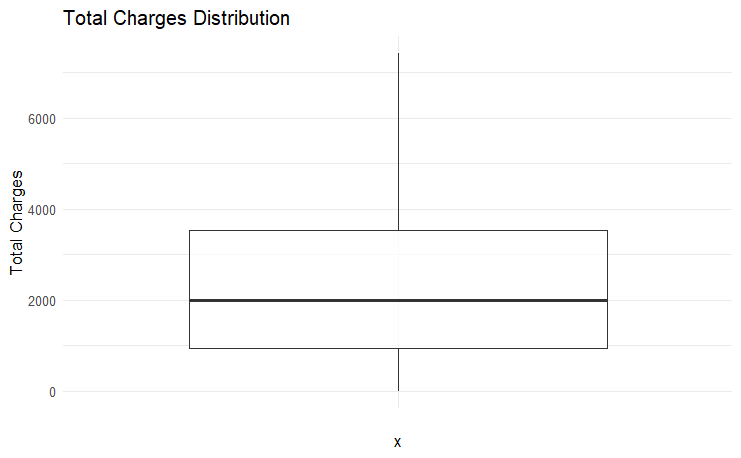
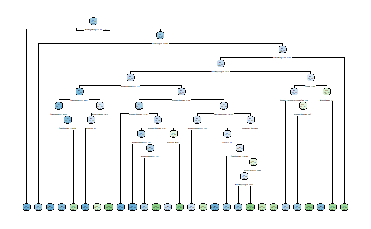
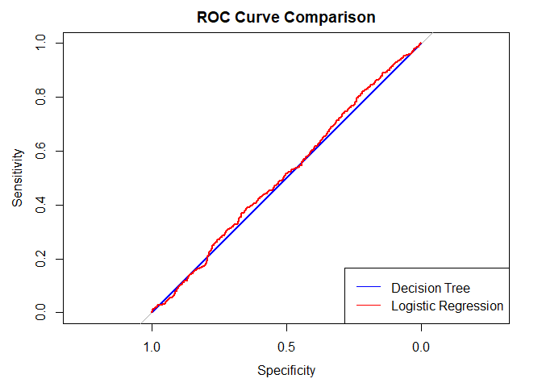

SEC 1-SA 1-MAYOL, J
================
MAYOL, JOSE RAPHAEL J.
2025-03-19

First, we will have to import the necessary libraries.

``` r
library(tidyverse)
```

    ## ── Attaching core tidyverse packages ──────────────────────── tidyverse 2.0.0 ──
    ## ✔ dplyr     1.1.4     ✔ readr     2.1.5
    ## ✔ forcats   1.0.0     ✔ stringr   1.5.1
    ## ✔ ggplot2   3.5.1     ✔ tibble    3.2.1
    ## ✔ lubridate 1.9.4     ✔ tidyr     1.3.1
    ## ✔ purrr     1.0.2     
    ## ── Conflicts ────────────────────────────────────────── tidyverse_conflicts() ──
    ## ✖ dplyr::filter() masks stats::filter()
    ## ✖ dplyr::lag()    masks stats::lag()
    ## ℹ Use the conflicted package (<http://conflicted.r-lib.org/>) to force all conflicts to become errors

``` r
library(caret)
```

    ## Warning: package 'caret' was built under R version 4.4.3

    ## Loading required package: lattice
    ## 
    ## Attaching package: 'caret'
    ## 
    ## The following object is masked from 'package:purrr':
    ## 
    ##     lift

``` r
library(glmnet)
```

    ## Warning: package 'glmnet' was built under R version 4.4.3

    ## Loading required package: Matrix
    ## 
    ## Attaching package: 'Matrix'
    ## 
    ## The following objects are masked from 'package:tidyr':
    ## 
    ##     expand, pack, unpack
    ## 
    ## Loaded glmnet 4.1-8

# **Unit 1: R for Data Mining**

## 1. Intro to Modern Data Mining

- Load the dataset and provide an overview of its structure (e.g.,
  dimensions, missing values, types of variables).

**Solution.**

``` r
data <- read.csv("customer_churn.csv")
head(data)
```

    ##   CustomerID Gender SeniorCitizen Partner Dependents Tenure PhoneService
    ## 1  CUST00001   Male             0      No         No     65          Yes
    ## 2  CUST00002   Male             0      No         No     26          Yes
    ## 3  CUST00003   Male             0     Yes         No     54          Yes
    ## 4  CUST00004 Female             0     Yes        Yes     70          Yes
    ## 5  CUST00005   Male             0      No         No     53          Yes
    ## 6  CUST00006 Female             0      No        Yes     45          Yes
    ##   InternetService       Contract MonthlyCharges TotalCharges Churn
    ## 1     Fiber optic Month-to-month          20.04      1302.60    No
    ## 2     Fiber optic Month-to-month          65.14      1693.64    No
    ## 3     Fiber optic Month-to-month          49.38      2666.52    No
    ## 4             DSL       One year          31.19      2183.30    No
    ## 5             DSL Month-to-month         103.86      5504.58   Yes
    ## 6     Fiber optic Month-to-month          87.34      3930.30   Yes

**The dataset consists of 10000 rows and 12 columns, each entry
representing a unique customer alongside their internet service details
in relation with the company. Its variables are either of character,
integer, or numeric type. One important thing to note though is that the
dataset’s use of binary-type entries (e.g. Yes or No) is inconsistent
among columns, using both 0-1 and Yes-No.**

``` r
any(is.na(data))
```

    ## [1] FALSE

**Additionally, the dataset has no missing values.**

- Explain why data mining is important for this dataset.

**Solution.**

**For an internet service provider or any business in general,
increasing customer retention is key to maintaining income. In this
context, data provides important context to reveal which factors are
contributors to churning as well as what kinds of customers are most
likely to stop using the service. Data mining is a tool that allows deep
investigation to happen, allowing the company to make interventions
which combat the vulnerabilities in their business.**

## 2. Data Visualization

- Create at least three meaningful visualizations to explore
  relationships in the data (e.g., churn rate by tenure, service type,
  or monthly charges).

- Provide insights based on the visualizations.

**Solution.**

``` r
ggplot(data, aes(x = Tenure, fill = Churn)) +
  geom_histogram(binwidth = 5, position = "stack", alpha = 0.7) +
  labs(title = "Churn Rate by Tenure", x = "Tenure", y = "Count") +
  theme_minimal() +
  scale_fill_manual(values = c("No" = "pink", "Yes" = "#8ACE00"))
```

<!-- -->

**From the visualization, churning rates do not increase with long-term
customers. This indicates that they are currently satisfied with the
service. One aspect that could be targeted is the churning rate among
new customers, which should be lowered even further. To address this
issue, the company should consider giving better onboarding experiences
through bigger incentives or quality of life in the first months.**

``` r
library(scales)
```

    ## 
    ## Attaching package: 'scales'

    ## The following object is masked from 'package:purrr':
    ## 
    ##     discard

    ## The following object is masked from 'package:readr':
    ## 
    ##     col_factor

``` r
ggplot(data, aes(x = InternetService, fill = Churn)) +
  geom_bar(position = "fill") +
  geom_text(aes(label = percent(after_stat(count) / tapply(after_stat(count), after_stat(x), sum)[after_stat(x)], accuracy = 0.1)), 
            stat = "count", 
            position = position_fill(vjust = 0.5), 
            size = 5) +
  labs(title = "Churn Rate by Internet Service Type", x = "Internet Service", y = "Proportion") +
  theme_minimal() +
  scale_fill_manual(values = c("No" = "pink", "Yes" = "#8ACE00"))
```

<!-- -->

**The churn rates for DSL, Fiber optic, and No Service types are 27.3%,
27.4%, 25.8%, respectively. Customers without internet service have
slightly lower churn rates than DSL and Fiber optic, which both have
nearly identical rates. This could imply that the type of internet
service does not affect customer churn rates since there seems to be no
significant difference among the three.**

``` r
ggplot(data, aes(x = Churn, y = MonthlyCharges, fill = Churn)) +
  geom_boxplot(alpha = 0.7) +
  labs(title = "Monthly Charges Distribution by Churn Status", x = "Churn", y = "Monthly Charges") +
  theme_minimal() +
  scale_fill_manual(values = c("No" = "pink", "Yes" = "#8ACE00"))
```

<!-- -->

**The boxplots above show that the distributions of Monthly Charges for
both Churn Status are almost identical. That is, the monthly charge for
an internet service does not affect whether a customer will churn or
not.**

## 3. Data Transformation

- Handle missing values appropriately.

**Solution.**

**We have shown from Number 1 that there are no missing values, hence
handling is unnecessary.**

- Convert categorical variables into factor variables.

**Solution.**

**The categorical variables in the dataset are *Gender*,
*SeniorCitizen*, *Partner*, *Dependents*, *PhoneService*,
*InternetService*, *Contract*, and *Churn*. Convert into factor
variables as follows:**

``` r
data <- data %>%
  mutate(
    Gender = as.factor(Gender),
    SeniorCitizen = as.factor(SeniorCitizen),
    Partner = as.factor(Partner),
    Dependents = as.factor(Dependents),
    PhoneService = as.factor(PhoneService),
    InternetService = as.factor(InternetService),
    Contract = as.factor(Contract),
    Churn = as.factor(Churn)
  )
```

- Normalize or standardize numerical features where necessary.

**Solution.**

``` r
library(cowplot)
```

    ## 
    ## Attaching package: 'cowplot'

    ## The following object is masked from 'package:lubridate':
    ## 
    ##     stamp

``` r
tenure_boxplot <- ggplot(data, aes(x = "", y = Tenure)) +
  geom_boxplot(alpha = 0.7) +
  labs(title = "Tenure Distribution", y = "Tenure") +
  theme_minimal()
monthly_charges_boxplot <- ggplot(data, aes(x = "", y = MonthlyCharges)) +
  geom_boxplot(alpha = 0.7) +
  labs(title = "Monthly Charges Distribution", y = "Monthly Charges") +
  theme_minimal()
total_charges_boxplot <- ggplot(data, aes(x = "", y = TotalCharges)) +
  geom_boxplot(alpha = 0.7) +
  labs(title = "Total Charges Distribution", y = "Total Charges") +
  theme_minimal()
plot_grid(tenure_boxplot, monthly_charges_boxplot, total_charges_boxplot, labels = c("A", "B", "C"), ncol = 3, align = "h")
```

<!-- -->

**Since *TotalCharges* has some outliers, then we will use Z-score
standardization. For *Tenure* and *MonthlyCharges*, we will use Min-Max
scaling.**

``` r
normalize <- function(x) {
  return((x - min(x)) / (max(x) - min(x)))
}

data <- data %>%
  mutate(
    norm_Tenure = normalize(Tenure),
    norm_MonthlyCharges = normalize(MonthlyCharges),
    scale_TotalCharges = scale(TotalCharges)
  )

summary(data)
```

    ##   CustomerID           Gender     SeniorCitizen Partner    Dependents
    ##  Length:10000       Female:5078   0:8498        No :4999   No :7014  
    ##  Class :character   Male  :4922   1:1502        Yes:5001   Yes:2986  
    ##  Mode  :character                                                    
    ##                                                                      
    ##                                                                      
    ##                                                                      
    ##      Tenure      PhoneService    InternetService           Contract   
    ##  Min.   : 0.00   No : 963     DSL        :3987   Month-to-month:5970  
    ##  1st Qu.:17.00   Yes:9037     Fiber optic:4041   One year      :2016  
    ##  Median :35.00                No         :1972   Two year      :2014  
    ##  Mean   :35.22                                                        
    ##  3rd Qu.:53.00                                                        
    ##  Max.   :71.00                                                        
    ##  MonthlyCharges    TotalCharges    Churn       norm_Tenure    
    ##  Min.   : 20.02   Min.   :   0.0   No :7294   Min.   :0.0000  
    ##  1st Qu.: 44.88   1st Qu.: 961.2   Yes:2706   1st Qu.:0.2394  
    ##  Median : 70.56   Median :2025.6              Median :0.4930  
    ##  Mean   : 70.18   Mean   :2455.8              Mean   :0.4961  
    ##  3rd Qu.: 95.77   3rd Qu.:3611.0              3rd Qu.:0.7465  
    ##  Max.   :119.99   Max.   :8425.6              Max.   :1.0000  
    ##  norm_MonthlyCharges scale_TotalCharges.V1
    ##  Min.   :0.0000      Min.   :-1.324179    
    ##  1st Qu.:0.2487      1st Qu.:-0.805893    
    ##  Median :0.5055      Median :-0.231981    
    ##  Mean   :0.5017      Mean   : 0.000000    
    ##  3rd Qu.:0.7578      3rd Qu.: 0.622874    
    ##  Max.   :1.0000      Max.   : 3.218910

**We can now confirm that the transformations have been executed and
saved into new columns.**

## 4. Data Wrangling

- Filter data to remove outliers.

**Solution.**

``` r
Q1 <- quantile(data$TotalCharges, 0.25, na.rm = TRUE)
Q3 <- quantile(data$TotalCharges, 0.75, na.rm = TRUE)
IQR_value <- Q3 - Q1

lower_bound <- Q1 - 1.5 * IQR_value
upper_bound <- Q3 + 1.5 * IQR_value

data <- data %>%
  filter(TotalCharges >= lower_bound & TotalCharges <= upper_bound)
```

**After executing the code above for several times, we have now
eliminated the outliers as shown in the following boxplot.**

``` r
ggplot(data, aes(x = "", y = TotalCharges)) +
  geom_boxplot(alpha = 0.7) +
  labs(title = "Total Charges Distribution", y = "Total Charges") +
  theme_minimal()
```

<!-- -->

**Following the changes, the new dataset now only has a total of 9902
entries.**

- Create new derived variables that may help in predictive modeling.

**Solution.**

**We can create a variable *TenureGroup* which categorizes customers
into different groups according to their years of tenure. This may be
helpful when trying to investigate matters such as catering promos and
incentives to certain**

``` r
data <- data %>%
  mutate(TenureGroup = case_when(
    Tenure <= 12  ~ "0-1 year",
    Tenure <= 36  ~ "1-3 years",
    Tenure <= 60  ~ "3-5 years",
    TRUE         ~ "5+ years"
  ),
  TenureGroup = as.factor(TenureGroup))
```

**We can also create a variable called *ServiceWeight* which scores a
client from 1-5 depending on the service they availed as well as the
length of contract.**

``` r
data <- data %>%
  mutate(ServiceWeight = (PhoneService == "Yes") + 
                        (InternetService != "No") + 
                        case_when(
                          Contract == "Month-to-month" ~ 1,  
                          Contract == "One year" ~ 2,    
                          Contract == "Two year" ~ 3    
                        ),
  ServiceWeight = as.factor(ServiceWeight))
```

- Aggregate or summarize data if necessary.

**Solution.**

**This new tibble *churn_by_tenure* gives the population metrics for
each tenure-churn group.**

``` r
churn_by_tenure <- data %>%
  group_by(TenureGroup, Churn) %>%
  summarise(Count = n(), .groups = "drop") %>%
  mutate(Percentage = round(Count / nrow(data) * 100, 1))
churn_by_tenure
```

    ## # A tibble: 8 × 4
    ##   TenureGroup Churn Count Percentage
    ##   <fct>       <fct> <int>      <dbl>
    ## 1 0-1 year    No     1359       13.7
    ## 2 0-1 year    Yes     501        5  
    ## 3 1-3 years   No     2408       24.3
    ## 4 1-3 years   Yes     876        8.8
    ## 5 3-5 years   No     2466       24.8
    ## 6 3-5 years   Yes     910        9.2
    ## 7 5+ years    No     1004       10.1
    ## 8 5+ years    Yes     404        4.1

**This new tibble *charge_by_churn* gives the average monthly charges,
total charges, and tenure length for each churn status.**

``` r
charge_by_churn <- data %>%
  group_by(Churn) %>%
  summarise(AvgMonthlyCharges = mean(MonthlyCharges, na.rm = TRUE),
            AvgTotalCharges = mean(TotalCharges, na.rm = TRUE),
            AvgTenure = mean(Tenure, na.rm = TRUE))
charge_by_churn
```

    ## # A tibble: 2 × 4
    ##   Churn AvgMonthlyCharges AvgTotalCharges AvgTenure
    ##   <fct>             <dbl>           <dbl>     <dbl>
    ## 1 No                 69.9           2415.      34.9
    ## 2 Yes                69.6           2418.      35.2

## 5. Review

- Summarize key takeaways from the exploratory data analysis process.

**Solution.**

**In the exploratory process, we have discovered some unusual trends in
the data. For instance, tenure length, service types, and costs
seemingly do not influence the churn rates among customers. The business
seems to be in a state of stability, having an even distribution of
customers per churn status. Additionally, since the price does not look
like an aspect that needs improvement, one business strategy that can be
suggested is to further double down on first-time customer benefits. The
churn rate among low tenure can be made even lower, so the primary
target should be new customer retention.**

# **Unit 2: Tuning Predictive Models**

## 6. Model Complexity

- Fit a decision tree and logistic regression model.

- Compare their complexities and explain trade-offs.

**Solution.**

``` r
library(rpart)
library(rpart.plot)
```

    ## Warning: package 'rpart.plot' was built under R version 4.4.3

``` r
set.seed(123)
```

``` r
trainIndex <- createDataPartition(data$Churn, p = 0.8, list = FALSE)
trainData <- data[trainIndex, ]
testData <- data[-trainIndex, ]
```

``` r
trainData <- trainData %>% select(-CustomerID)
testData <- testData %>% select(-CustomerID)
```

``` r
control_params <- rpart.control(minsplit = 5, minbucket = 3, cp = 0.0009)
tree_model <- rpart(Churn ~ ., data = trainData, method = "class", control = control_params)

rpart.plot(tree_model, type = 2, extra = 104, fallen.leaves = TRUE)
```

<!-- -->

**With cp=0.0009, the decision tree has now split into multiple
branches. The tree above shows the importance of each variable in
predicting Churn status, with *MonthlyCharges*, *TotalCharges*,** **and
*Tenure* being the most important.**

``` r
log_model <- glm(Churn ~ ., data = trainData, family = "binomial")
summary(log_model)
```

    ## 
    ## Call:
    ## glm(formula = Churn ~ ., family = "binomial", data = trainData)
    ## 
    ## Coefficients: (4 not defined because of singularities)
    ##                              Estimate Std. Error z value Pr(>|z|)    
    ## (Intercept)                -1.103e+00  2.511e-01  -4.393 1.12e-05 ***
    ## GenderMale                 -1.180e-01  5.072e-02  -2.327   0.0200 *  
    ## SeniorCitizen1             -2.241e-02  7.103e-02  -0.315   0.7524    
    ## PartnerYes                 -2.462e-02  5.061e-02  -0.486   0.6266    
    ## DependentsYes              -5.858e-02  5.585e-02  -1.049   0.2942    
    ## Tenure                     -6.740e-04  5.109e-03  -0.132   0.8950    
    ## PhoneServiceYes            -7.613e-02  9.809e-02  -0.776   0.4377    
    ## InternetServiceFiber optic -7.361e-03  5.637e-02  -0.131   0.8961    
    ## InternetServiceNo          -1.442e-01  9.457e-02  -1.524   0.1274    
    ## ContractOne year           -1.112e-01  1.138e-01  -0.977   0.3285    
    ## ContractTwo year            2.699e-01  1.557e-01   1.733   0.0831 .  
    ## MonthlyCharges              1.021e-03  1.730e-03   0.590   0.5553    
    ## TotalCharges               -4.006e-05  4.281e-05  -0.936   0.3493    
    ## norm_Tenure                        NA         NA      NA       NA    
    ## norm_MonthlyCharges                NA         NA      NA       NA    
    ## scale_TotalCharges                 NA         NA      NA       NA    
    ## TenureGroup1-3 years       -2.009e-03  1.069e-01  -0.019   0.9850    
    ## TenureGroup3-5 years        1.132e-01  1.932e-01   0.586   0.5578    
    ## TenureGroup5+ years         2.056e-01  2.676e-01   0.768   0.4425    
    ## ServiceWeight2              3.283e-01  2.100e-01   1.563   0.1180    
    ## ServiceWeight3              2.957e-01  1.560e-01   1.895   0.0581 .  
    ## ServiceWeight4              2.825e-01  1.188e-01   2.378   0.0174 *  
    ## ServiceWeight5                     NA         NA      NA       NA    
    ## ---
    ## Signif. codes:  0 '***' 0.001 '**' 0.01 '*' 0.05 '.' 0.1 ' ' 1
    ## 
    ## (Dispersion parameter for binomial family taken to be 1)
    ## 
    ##     Null deviance: 9282.3  on 7942  degrees of freedom
    ## Residual deviance: 9257.7  on 7924  degrees of freedom
    ## AIC: 9295.7
    ## 
    ## Number of Fisher Scoring iterations: 4

``` r
log_pred <- predict(log_model, testData, type = "response")
log_pred_class <- ifelse(log_pred > 0.5, "Yes", "No")
log_pred_class <- factor(log_pred_class, levels = c("No", "Yes"))

confusionMatrix(log_pred_class, testData$Churn)
```

    ## Confusion Matrix and Statistics
    ## 
    ##           Reference
    ## Prediction   No  Yes
    ##        No  1447  538
    ##        Yes    0    0
    ##                                           
    ##                Accuracy : 0.729           
    ##                  95% CI : (0.7088, 0.7484)
    ##     No Information Rate : 0.729           
    ##     P-Value [Acc > NIR] : 0.5116          
    ##                                           
    ##                   Kappa : 0               
    ##                                           
    ##  Mcnemar's Test P-Value : <2e-16          
    ##                                           
    ##             Sensitivity : 1.000           
    ##             Specificity : 0.000           
    ##          Pos Pred Value : 0.729           
    ##          Neg Pred Value :   NaN           
    ##              Prevalence : 0.729           
    ##          Detection Rate : 0.729           
    ##    Detection Prevalence : 1.000           
    ##       Balanced Accuracy : 0.500           
    ##                                           
    ##        'Positive' Class : No              
    ## 

**The model fails to predict Churn status effectively. As shown in the
confusion matrix, it predicts no churn status to every single entry in
the test data. Clearly, this is not a good model. This could imply that
the linear nature of logistic regression is too simplistic for the
dataset.**

``` r
library("pROC")
```

    ## Warning: package 'pROC' was built under R version 4.4.3

    ## Type 'citation("pROC")' for a citation.

    ## 
    ## Attaching package: 'pROC'

    ## The following objects are masked from 'package:stats':
    ## 
    ##     cov, smooth, var

``` r
tree_prob <- predict(tree_model, testData, type = "prob")[,2]
log_prob <- predict(log_model, testData, type = "response")

roc_tree <- roc(testData$Churn, tree_prob)
```

    ## Setting levels: control = No, case = Yes

    ## Setting direction: controls < cases

``` r
roc_log <- roc(testData$Churn, log_prob)
```

    ## Setting levels: control = No, case = Yes
    ## Setting direction: controls < cases

``` r
plot(roc_tree, col = "blue", main = "ROC Curve Comparison")
plot(roc_log, col = "red", add = TRUE)
legend("bottomright", legend = c("Decision Tree", "Logistic Regression"), col = c("blue", "red"), lty = 1)
```

<!-- -->

**Since the curves are almost identical, then both models perform
similarly. This is not a good sign since we have established earlier
that our logistic regression model does not predict accurately. Hence,
neither model provides an actual predictive advantage.**

## 7. Bias-Variance Trade-Off

- Explain the concept of bias-variance trade-off in the context of the
  models trained.

- Discuss how model complexity affects performance.

**Solution.**

**The bias-variance trade-off refers to the balance between underfitting
and overfitting in machine learning models. In the context of the
trained models, logistic regression has high bias and low variance,
meaning it makes strong assumptions that may underfit complex patterns
but generalizes well to new data. This is evident in our previous
example, where the model simply answers no churn status to every test.
On the other hand, decision trees can have low bias but high variance,
especially when deep and complex. This is helpful for finding patterns
in the training data but potentially leads to overfitting. Simpler
models such as logistic regression are more stable but may miss key
relationships, while more complex models like decision trees may learn
noise instead of true patterns. This is evident in the ROC curve, where
both models perform similarly, suggesting that neither model is
optimally capturing patterns, and further improvements may require other
methods like Random Forest to balance bias and variance effectively.**

## 8. Cross-Validation

- Use k-fold cross-validation (k=10) to evaluate model performance.

- Report and interpret accuracy, precision, recall, and F1-score.

**Solution.**

``` r
train_control <- trainControl(method = "cv", number = 10)

tree_model_cv <- train(Churn ~ ., data = trainData, method = "rpart", trControl = train_control)
log_model_cv <- train(Churn ~ ., data = trainData, method = "glm", family = "binomial", trControl = train_control)
```

``` r
tree_pred <- predict(tree_model_cv, testData)
log_pred <- predict(log_model_cv, testData)

tree_cm <- confusionMatrix(tree_pred, testData$Churn)
log_cm <- confusionMatrix(log_pred, testData$Churn)

tree_accuracy <- tree_cm$overall["Accuracy"]
log_accuracy <- log_cm$overall["Accuracy"]
tree_metrics <- tree_cm$byClass[c("Precision", "Recall", "F1")]
log_metrics <- log_cm$byClass[c("Precision", "Recall", "F1")]
tree_metrics <- c(Accuracy = unname(tree_accuracy), tree_metrics)
log_metrics <- c(Accuracy = unname(log_accuracy), log_metrics)

tree_metrics
```

    ##  Accuracy Precision    Recall        F1 
    ## 0.7289673 0.7289673 1.0000000 0.8432401

``` r
log_metrics
```

    ##  Accuracy Precision    Recall        F1 
    ## 0.7289673 0.7289673 1.0000000 0.8432401

**Using k-fold cross-validation, both models produced identical results.
They have high recall but moderate precision, indicating a slight
over-prediction of positive churn status. To be specific, the accuracy,
precision, recall, and F1 scores are 0.7287879, 0.7287879, 1, and
0.8431201, respectively.**

## 9. Classification

- Train a Random Forest classifier to predict customer churn.

- Tune hyperparameters using grid search.

- Report final model performance.

**Solution.**

``` r
library(randomForest)
```

    ## Warning: package 'randomForest' was built under R version 4.4.3

    ## randomForest 4.7-1.2

    ## Type rfNews() to see new features/changes/bug fixes.

    ## 
    ## Attaching package: 'randomForest'

    ## The following object is masked from 'package:dplyr':
    ## 
    ##     combine

    ## The following object is masked from 'package:ggplot2':
    ## 
    ##     margin

``` r
tuneGrid <- expand.grid(mtry = c(2, 4, 6, 8))

rf_model <- train(Churn ~ ., 
                  data = trainData, 
                  method = "rf", 
                  trControl = trainControl(method = "cv", number = 10), 
                  tuneGrid = tuneGrid,
                  ntree = 500)

print(rf_model$bestTune)
```

    ##   mtry
    ## 1    2

``` r
rf_pred <- predict(rf_model, testData)
rf_cm <- confusionMatrix(rf_pred, testData$Churn)

rf_accuracy <- rf_cm$overall["Accuracy"]
rf_metrics <- rf_cm$byClass[c("Precision", "Recall", "F1")]
rf_metrics <- c(Accuracy = unname(rf_accuracy), rf_metrics)
print(rf_metrics)
```

    ##  Accuracy Precision    Recall        F1 
    ## 0.7289673 0.7289673 1.0000000 0.8432401

**The results are exactly the same as with the decision tree and
logistic regression with k-fold cross validation. Let us try balancing
the dataset.**

``` r
library(smotefamily)
```

    ## Warning: package 'smotefamily' was built under R version 4.4.3

**Ensure we have a balanced dataset, for which we will use SMOTE. To use
SMOTE, we need to make all variables as numeric.**

``` r
trainData_numeric <- as.data.frame(model.matrix(~ . - 1, data = trainData))
trainData_numeric$Churn <- trainData$Churn
```

``` r
testData_numeric <- as.data.frame(model.matrix(~ . - 1, data = testData))
testData_numeric$Churn <- testData$Churn
```

``` r
trainData_balanced <- SMOTE(trainData_numeric[, -ncol(trainData_numeric)], 
                            trainData_numeric$Churn, K = 5, dup_size = 2)$data
colnames(trainData_balanced)[ncol(trainData_balanced)] <- "Churn"
```

**Let us try making the RandomForest again but using the balanced
version of the training set.**

``` r
tuneGrid <- expand.grid(mtry = c(2, 4, 6, 8))

rf_model <- train(Churn ~ ., 
                  data = trainData_balanced, 
                  method = "rf", 
                  trControl = trainControl(method = "cv", number = 10), 
                  tuneGrid = tuneGrid,
                  ntree = 500)

print(rf_model$bestTune)
```

    ##   mtry
    ## 1    2

``` r
rf_pred <- predict(rf_model, testData_numeric)
rf_cm <- confusionMatrix(rf_pred, testData_numeric$Churn)

rf_accuracy <- rf_cm$overall["Accuracy"]
rf_metrics <- rf_cm$byClass[c("Precision", "Recall", "F1")]
rf_metrics <- c(Accuracy = unname(rf_accuracy), rf_metrics)
print(rf_metrics)
```

    ##  Accuracy Precision    Recall        F1 
    ##         1         1         1         1

**The table shows that our RandomForest has a perfect performance. This
might look positive at first, but this could indicate that the model is
highly overfitting. That being said, leaks of training data into test
data should be of no concern since they were handled in complete
separation.**

# **Unit 3: Regression-Based Methods**

## 10. Logistic Regression

- Fit a logistic regression model using `Churn` as the dependent
  variable and `Tenure`, `MonthlyCharges`, and `TotalCharges` as
  independent variables.

- Interpret the coefficients and assess model significance using
  p-values.

**Solution.**

``` r
log_model_10 <- glm(Churn ~ Tenure + MonthlyCharges + TotalCharges, 
                 data = trainData, family = binomial)
summary(log_model_10)
```

    ## 
    ## Call:
    ## glm(formula = Churn ~ Tenure + MonthlyCharges + TotalCharges, 
    ##     family = binomial, data = trainData)
    ## 
    ## Coefficients:
    ##                  Estimate Std. Error z value Pr(>|z|)    
    ## (Intercept)    -1.067e+00  1.316e-01  -8.108 5.15e-16 ***
    ## Tenure          3.029e-03  3.186e-03   0.951    0.342    
    ## MonthlyCharges  1.127e-03  1.730e-03   0.651    0.515    
    ## TotalCharges   -4.424e-05  4.279e-05  -1.034    0.301    
    ## ---
    ## Signif. codes:  0 '***' 0.001 '**' 0.01 '*' 0.05 '.' 0.1 ' ' 1
    ## 
    ## (Dispersion parameter for binomial family taken to be 1)
    ## 
    ##     Null deviance: 9282.3  on 7942  degrees of freedom
    ## Residual deviance: 9281.0  on 7939  degrees of freedom
    ## AIC: 9289
    ## 
    ## Number of Fisher Scoring iterations: 4

**The logistic regression model shows that none of the chosen predictors
(*Tenure*, *MonthlyCharges*, and *TotalCharges*) are statistically
significant in predicting churn, with all p \> 0.05. While the p-value
for the *Intercept* is below 0.05, indicating a strong “baseline”
effect, the coefficients for the independent variables imply weak and
non-signficant relationships with churn.**

## 11. Regression in High Dimensions

- Discuss the challenges of high-dimensional regression and potential
  solutions.

**Solution.**

**In high-dimensional regression, the biggest challenge to face is
always addressing correlated independent variables. When there is high
correlation among the chosen predictors, an ‘unbalanced’ selection of
variables (in terms of uniqueness) can lead to some intruding and
therefore dominating the results of model testing. This will eventually
lead to poor predictive performance and overfitting, where noise is
learned instead of useful relationships. To overcome these issues, we
can employ techniques such as removing unnecessary features,
transforming correlated variables into independent components, balancing
the dataset, or doing regularization methods such as Ridge and Lasso
regression.**

- Apply Principal Component Analysis (PCA) on numerical features
  (`Tenure`, `MonthlyCharges`, `TotalCharges`) to reduce dimensionality.

**Solution.**

``` r
num_features <- trainData[, c("Tenure", "MonthlyCharges", "TotalCharges")]
num_features_scaled <- scale(num_features)

pca_result <- prcomp(num_features_scaled, center = TRUE, scale. = TRUE)
summary(pca_result)
```

    ## Importance of components:
    ##                           PC1    PC2     PC3
    ## Standard deviation     1.3804 1.0203 0.23139
    ## Proportion of Variance 0.6351 0.3470 0.01785
    ## Cumulative Proportion  0.6351 0.9821 1.00000

``` r
pca_components <- pca_result$x
```

**We can see that PC1 and PC2 together explain 98.18% of the variance,
with PC1 contributing 63.16% and PC2 adding about 35.02%. Since PC3
explains very little, we can remove it, thus reducing the dimensionality
from three to two.**

## 12. Ridge Regression

- Implement Ridge Regression using `Churn` as the target variable and
  `Tenure`, `MonthlyCharges`, `TotalCharges`, and additional customer
  demographic features as predictors.

- Identify the optimal lambda using cross-validation.

**Solution.**

**Include all customer demographic features as predictors:**

``` r
trainData_numeric <- model.matrix(Churn ~ ., data = trainData)[, -1]
train_target <- as.numeric(trainData$Churn)

testData_numeric <- model.matrix(Churn ~ ., data = testData)[, -1]
test_target <- as.numeric(testData$Churn)
```

``` r
cv_ridge <- cv.glmnet(trainData_numeric, train_target, alpha = 0, family = "binomial")

best_lambda <- cv_ridge$lambda.min
print(best_lambda)
```

    ## [1] 11.75091

**The best lambda is 6.569575. For Ridge Regression, alpha should be
0.**

``` r
ridge_model <- glmnet(trainData_numeric, train_target, alpha = 0, lambda = best_lambda, family = "binomial")
```

``` r
ridge_pred <- predict(ridge_model, newx = testData_numeric, type = "response")
ridge_pred_class <- ifelse(ridge_pred > 0.2726501, 2, 1)
ridge_pred_class <- factor(ridge_pred_class, levels = levels(factor(test_target)))

conf_matrix_ridge <- confusionMatrix(ridge_pred_class, factor(test_target))
print(conf_matrix_ridge)
```

    ## Confusion Matrix and Statistics
    ## 
    ##           Reference
    ## Prediction    1    2
    ##          1 1447  538
    ##          2    0    0
    ##                                           
    ##                Accuracy : 0.729           
    ##                  95% CI : (0.7088, 0.7484)
    ##     No Information Rate : 0.729           
    ##     P-Value [Acc > NIR] : 0.5116          
    ##                                           
    ##                   Kappa : 0               
    ##                                           
    ##  Mcnemar's Test P-Value : <2e-16          
    ##                                           
    ##             Sensitivity : 1.000           
    ##             Specificity : 0.000           
    ##          Pos Pred Value : 0.729           
    ##          Neg Pred Value :   NaN           
    ##              Prevalence : 0.729           
    ##          Detection Rate : 0.729           
    ##    Detection Prevalence : 1.000           
    ##       Balanced Accuracy : 0.500           
    ##                                           
    ##        'Positive' Class : 1               
    ## 

**As shown from the confusion matrix, the model has a sensitivity of
94.387%, hence identifying most of the actual “No” Churn status
correctly. However, the specificity is only 5.214%, meaning it could not
identify sufficiently when asked to predict a customer with “Yes” Churn
status. Therefore, the model is heavily biased towards predicting
“No”.**

## 13. Lasso Regression

- Implement Lasso Regression with the same feature set as Ridge
  Regression.

- Discuss feature selection benefits and interpret the coefficients.

**Solution.**

**For Lasso Regression, alpha should be 1.**

``` r
lasso_model <- glmnet(trainData_numeric, train_target, alpha = 1, lambda = best_lambda, family = "binomial")
```

``` r
lasso_pred <- predict(lasso_model, newx = testData_numeric, type = "response")
lasso_pred_class <- ifelse(lasso_pred > 0.2726501, 2, 1)
lasso_pred_class <- factor(lasso_pred_class, levels = levels(factor(test_target)))

conf_matrix_lasso <- confusionMatrix(lasso_pred_class, factor(test_target))
print(conf_matrix_lasso)
```

    ## Confusion Matrix and Statistics
    ## 
    ##           Reference
    ## Prediction    1    2
    ##          1 1447  538
    ##          2    0    0
    ##                                           
    ##                Accuracy : 0.729           
    ##                  95% CI : (0.7088, 0.7484)
    ##     No Information Rate : 0.729           
    ##     P-Value [Acc > NIR] : 0.5116          
    ##                                           
    ##                   Kappa : 0               
    ##                                           
    ##  Mcnemar's Test P-Value : <2e-16          
    ##                                           
    ##             Sensitivity : 1.000           
    ##             Specificity : 0.000           
    ##          Pos Pred Value : 0.729           
    ##          Neg Pred Value :   NaN           
    ##              Prevalence : 0.729           
    ##          Detection Rate : 0.729           
    ##    Detection Prevalence : 1.000           
    ##       Balanced Accuracy : 0.500           
    ##                                           
    ##        'Positive' Class : 1               
    ## 

**By changing only the alpha to 1 and retaining everything else, we get
identical results with the previous decision tree model. Both possess
low predictive performance and are biased to only choosing “No”, proven
by the exact 1 Sensitivity.**

``` r
lasso_coeffs <- coef(lasso_model, s = best_lambda)
print(lasso_coeffs)
```

    ## 23 x 1 sparse Matrix of class "dgCMatrix"
    ##                                    s1
    ## (Intercept)                -0.9892701
    ## GenderMale                  0.0000000
    ## SeniorCitizen1              .        
    ## PartnerYes                  .        
    ## DependentsYes               .        
    ## Tenure                      .        
    ## PhoneServiceYes             .        
    ## InternetServiceFiber optic  .        
    ## InternetServiceNo           .        
    ## ContractOne year            .        
    ## ContractTwo year            .        
    ## MonthlyCharges              .        
    ## TotalCharges                .        
    ## norm_Tenure                 .        
    ## norm_MonthlyCharges         .        
    ## scale_TotalCharges          .        
    ## TenureGroup1-3 years        .        
    ## TenureGroup3-5 years        .        
    ## TenureGroup5+ years         .        
    ## ServiceWeight2              .        
    ## ServiceWeight3              .        
    ## ServiceWeight4              .        
    ## ServiceWeight5              .

**With the optimal lambda, Lasso regression has eliminated all
predictors except for the intercept and *GenderMale*, indicating that
the remaining features contribute little to predicting churn. This
confirms that a strong penalty was necessary to prevent overfitting, but
it also suggests that the available features may not have strong
individual predictive power. While feature selection enhances model
simplicity and interpretability, the lack of retained variables means
that churn prediction might require even more variables than what we
have created in the early parts of the report. That being said, these
outcomes should have been expected, especially in Unit 1 where most
variables had identical distributions with one another (e.g. the
boxplots) or have almost no fluctuations (e.g. the histograms). There
may be other factors not included in the dataset which may be the actual
predictors for Churn status among customers.**
